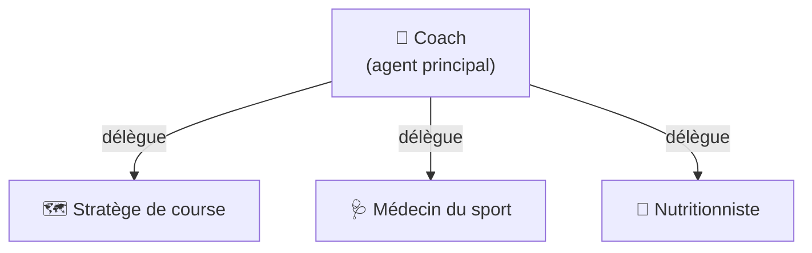

# 🧠 Agents

`ai-running-coach` fournit **4 agents spécialisés** qui collaborent pour vous aider à préparer votre objectif.

## Vue d'ensemble

## Les agents

### 🏃 Coach (`coach.md`)

L'agent **principal**. Il gère :

- La **définition et le suivi de l'objectif** (`planning/active_objective.md`)
- La **planification hebdomadaire** et l'ajustement des séances
- Le **push des séances dans le calendrier Garmin Connect**
- L'analyse **météo** avant chaque validation
- La **récupération cardiaque (HRR)** dans chaque analyse de séance
- La coordination des autres agents

[→ Détails de l'agent coach](agents/coach.md)

### 🗺️ Stratège de course (`course-strategist.md`)

Spécialiste de la **stratégie de course** :

- Analyse du **parcours** (GPX ou URL)
- Points d'eau et ravitaillement (OpenStreetMap)
- **3 scénarios d'allure** (prudent, nominal, ambitieux)
- Plan de **nutrition** et **hydratation** en course
- Préparation **météo** et **matériel**
- **Push de la séance dans Garmin**

[→ Détails de l'agent stratège](agents/course-strategist.md)

### 🩺 Médecin (`medical.md`)

Spécialiste de la **récupération** et de la **santé** :

- Analyse des métriques de santé (HRV, sommeil, stress)
- **Gatekeeper** de la disponibilité à l'entraînement
- Prévention des blessures
- Coordination avec le coach et le nutritionniste

[→ Détails de l'agent médecin](agents/medical.md)

### 🥗 Nutritionniste (`nutritionist.md`)

Spécialiste de la **nutrition sportive** :

- Suivi des **macros** (glucides, protéines, lipides)
- Stratégie de **poids de course**
- Recharge en glycogène après les séances intenses
- Comparaison apports / dépenses (calories Garmin)

[→ Détails de l'agent nutritionniste](agents/nutritionist.md)

## Comment les agents collaborent

1. Vous demandez à l'agent **`coach`** de définir votre objectif
2. Le coach établit le plan d'entraînement et le pousse dans **Garmin Connect**
3. Le coach **délègue** aux agents spécialisés selon les besoins :
   - **Stratège de course** : analyse du parcours et stratégie
   - **Médecin** : évaluation de la récupération et de la santé
   - **Nutritionniste** : plan nutritionnel
4. Chaque agent **persiste** ses résultats dans les dossiers dédiés (`planning/`, `medical/`, `nutrition/`, `rapports/`)

## Dossiers de travail

| Dossier | Contenu |
|---|---|
| `planning/` | Objectif actif, plans hebdomadaires, profil du coureur |
| `activities/` | Activités Garmin synchronisées |
| `medical/` | Santé, sommeil, récupération, météo |
| `nutrition/` | Journaux nutritionnels |
| `rapports/` | Rapports de synthèse hebdomadaires |
| `resources/` | Documents de référence (fournis par l'utilisateur) |
