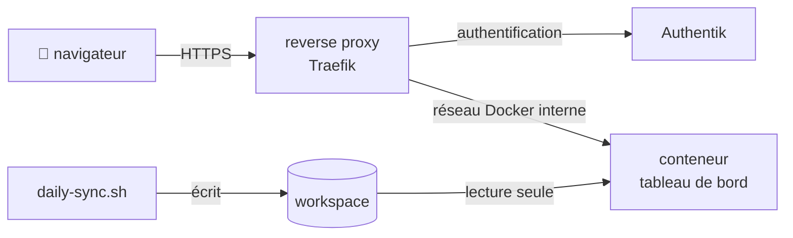

# Derrière un reverse proxy (Docker)

Si votre machine coach fait déjà tourner des services en conteneurs derrière un
reverse proxy — Traefik, avec une authentification unique (Authentik, Authelia) —,
le tableau de bord peut s'y ranger : une adresse comme `https://coach.example.org`,
ouverte depuis le téléphone après la connexion habituelle, au lieu d'un
[tunnel SSH](headless.md#sur-la-machine-coach-par-un-tunnel-ssh).

Le conteneur ne contient que le moteur (`scripts/`, `web/`, `config/`). Votre workspace
y est **monté en lecture seule** : le conteneur ne peut rien y écrire. L'index vit en
mémoire, se reconstruit au démarrage (quelques secondes pour quelques centaines de
fichiers) et se met à jour comme en local — un fichier écrit par la synchronisation
apparaît en moins de 30 secondes, sans redémarrer le conteneur.

!!! danger "Des données de santé, sans authentification propre"
    Le tableau de bord montre votre HRV, votre FC de repos, votre poids, vos verdicts
    médicaux. **Il n'a pas de connexion à lui** : c'est le reverse proxy qui protège
    l'accès. Le fichier compose fourni ne publie aucun port et refuse de démarrer sans
    middleware d'authentification. Ne contournez ni l'un ni l'autre.



## Mise en route

Sur la machine coach, dans le dépôt du moteur :

```bash
cd ~/ai-running-coach/deploy/dashboard
cp .env.example .env
```

Renseignez `.env` (il est ignoré par git) :

| Variable | Rôle |
|---|---|
| `ARC_DASHBOARD_HOST` | Nom public (`coach.example.org`). C'est aussi **le seul** en-tête `Host` que le serveur accepte : toute autre adresse reçoit un 403. |
| `ARC_WORKSPACE_HOST` | Chemin du workspace sur l'hôte, monté sur `/workspace` en lecture seule. |
| `ARC_UID`, `ARC_GID` | Propriétaire du workspace (`id -u`, `id -g`). `config/workspace.user.toml` est en mode 600 : un autre utilisateur ne pourrait pas le lire. |
| `TZ` | Fuseau horaire : il fixe « aujourd'hui ». |
| `TRAEFIK_NETWORK` | Réseau Docker sur lequel Traefik joint ses services. |
| `TRAEFIK_ENTRYPOINT` | Point d'entrée Traefik du routeur. |
| `TRAEFIK_AUTH_MIDDLEWARE` | **Obligatoire.** Middleware d'authentification déjà défini dans Traefik (`authentik@file`…). |
| `COMPOSE_FILE`, `AUTHENTIK_OUTPOST_SERVICE` | Avec Authentik uniquement : ajoutent la route de l'avant-poste (voir plus bas). |

Puis :

```bash
docker compose up -d --build
docker compose ps        # l'état passe à « healthy » en une trentaine de secondes
```

## Mettre à jour

L'image embarque le code du moteur ; vos fichiers, eux, sont lus en direct. Après un
`git pull` du moteur, reconstruisez :

```bash
cd ~/ai-running-coach && git pull
cd deploy/dashboard && docker compose up -d --build
```

## Exemple : Traefik, Authentik et un tunnel Cloudflare

Une configuration courante sur un serveur personnel : Cloudflare termine le HTTPS et
envoie le trafic par un tunnel (`cloudflared`) à Traefik, en HTTP sur le port 80 ;
Traefik vérifie la session auprès d'Authentik avant de transmettre.

### `.env`

```bash
ARC_DASHBOARD_HOST=coach.example.org
ARC_WORKSPACE_HOST=/home/moi/mon-workspace
ARC_UID=1000
ARC_GID=1000
TZ=Europe/Paris

TRAEFIK_NETWORK=traefik-network
# Le tunnel parle à Traefik en HTTP : même point d'entrée que vos autres services.
TRAEFIK_ENTRYPOINT=insecure
TRAEFIK_AUTH_MIDDLEWARE=authentik@file

COMPOSE_FILE=compose.yaml:compose.authentik.yaml
# Service Traefik (fournisseur file) qui pointe vers
# http://authentik:9000/outpost.goauthentik.io
AUTHENTIK_OUTPOST_SERVICE=sso@file
```

Reprenez les valeurs de vos services existants : le réseau, le point d'entrée et
les noms du middleware et du service de l'avant-poste sont ceux de votre
configuration Traefik.

`compose.authentik.yaml` ajoute un second routeur : les chemins
`/outpost.goauthentik.io/` du même hôte vont directement à l'avant-poste
d'Authentik. C'est par là qu'Authentik reçoit le retour de connexion.

### Authentik

Tout dépend du fournisseur *Proxy* qui protège vos services :

- **Forward auth (domain level)** : un seul fournisseur couvre tous les
  sous-domaines. Le nouveau nom est protégé d'office.
- **Forward auth (single application)** : un fournisseur par service. Créez un
  fournisseur *Proxy* dans ce mode, avec pour *External host*
  `https://coach.example.org`, une *Application* qui l'utilise, puis ajoutez
  l'application à l'avant-poste intégré (*Outposts* → *authentik Embedded Outpost*).

Dans les deux cas, **limitez l'application à votre compte** : liez-lui votre
utilisateur, ou un groupe qui ne contient que vous. Un compte invité de votre
Authentik, créé pour un autre service, n'a pas à voir vos données de santé.

### Cloudflare

Dans le tableau de bord Cloudflare, **Zero Trust → Networks → Tunnels** → votre
tunnel → **Public Hostname** → **Add a public hostname** :

| Champ | Valeur |
|---|---|
| Subdomain | `coach` |
| Domain | `example.org` |
| Type | `HTTP` |
| URL | la même que vos autres noms publics, par exemple `traefik` |

Cloudflare crée l'enregistrement DNS (un `CNAME` vers le tunnel). Rien d'autre à
ouvrir : aucun port de votre box n'est concerné.

Pour une seconde barrière, une application **Cloudflare Access** sur ce nom exige une
connexion chez Cloudflare avant même d'atteindre votre serveur.

### Sans Authentik

Supprimez les lignes `COMPOSE_FILE` et `AUTHENTIK_OUTPOST_SERVICE`, et nommez votre
propre middleware : `authelia@docker`, ou un `basicAuth` défini dans la
configuration dynamique de Traefik. Avec un point d'entrée HTTPS géré par Traefik,
`TRAEFIK_ENTRYPOINT=websecure` (le nom habituel).

## Ce que garantit le conteneur

| Garantie | Comment |
|---|---|
| Rien n'est écrit dans vos fichiers | Workspace monté `:ro`, index en mémoire (`--memory`) |
| Rien n'est écrit dans le conteneur | `read_only: true`, seul `/tmp` est un tmpfs |
| Pas de privilèges | Utilisateur non root (`ARC_UID`), `cap_drop: ALL`, `no-new-privileges` |
| Pas d'accès direct | Aucun port publié : seul Traefik, sur son réseau, l'atteint |
| Pas d'accès sans connexion | Middleware d'authentification obligatoire, compose refuse de démarrer sans |
| Pas de *DNS rebinding* | Seul `ARC_DASHBOARD_HOST` est accepté ; le serveur refuse de démarrer s'il n'est pas déclaré |
| Lecture seule côté HTTP | `POST`, `PUT`, `DELETE`, `PATCH` → 405 |
| Contenu verrouillé | En-tête `Content-Security-Policy` strict, émis par le serveur |

!!! note "En-têtes de sécurité ajoutés par le proxy"
    Si un middleware de votre point d'entrée définit lui-même
    `Content-Security-Policy` (`customResponseHeaders`), il remplace celle du tableau
    de bord, qui est plus stricte. Préférez un point d'entrée où ce n'est pas le cas.

La sonde `/healthz` sert au `HEALTHCHECK` de l'image ; elle ne réindexe rien.

## Dépannage

| Symptôme | Cause probable |
|---|---|
| `{"error": "hôte non autorisé"}` (403) | Le nom tapé dans le navigateur n'est pas `ARC_DASHBOARD_HOST`. |
| `404 page not found` de Traefik | Mauvais `TRAEFIK_NETWORK` ou `TRAEFIK_ENTRYPOINT` : comparez avec un service qui fonctionne. |
| Boucle de redirection, ou 404 après la connexion | La route de l'avant-poste manque (`COMPOSE_FILE`), ou Authentik ne connaît pas ce nom (fournisseur *single application*). |
| Le conteneur redémarre en boucle | `docker compose logs` : souvent `Permission denied` sur le workspace — `ARC_UID`/`ARC_GID` ne sont pas ceux du propriétaire. |
| « Aujourd'hui » bascule à 2 h du matin | `TZ` absent : le conteneur est en UTC. |

## Et sans Docker ?

`scripts/arc_serve.py` accepte `--listen` et `--allowed-host` (ou
`ARC_DASHBOARD_LISTEN` et `ARC_DASHBOARD_ALLOWED_HOSTS`) : c'est ce qu'utilise l'image.
Hors conteneur, `scripts/dashboard.sh` reste sur `127.0.0.1`. Pour une autre machine,
le [tunnel SSH](headless.md#sur-la-machine-coach-par-un-tunnel-ssh) est plus simple.
