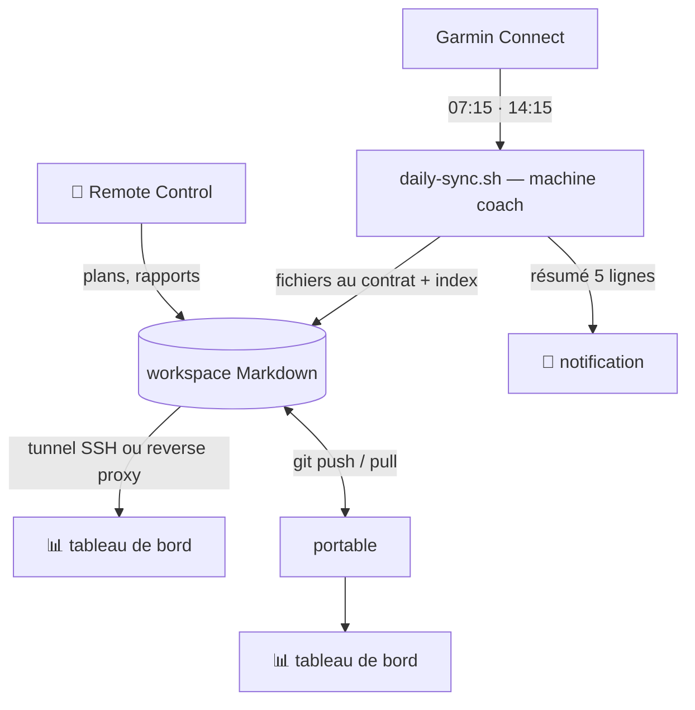

# Machine coach & mode headless

Avec une [machine coach](../mobile.md), le coach travaille sans vous : chaque matin
et chaque midi, la synchronisation récupère vos données Garmin, les écrit dans le
workspace (bilan du matin, séances) et vous envoie un résumé de cinq lignes sur le
téléphone. Le verdict du jour, lui, est posé par le coach quand vous lui demandez si
vous courez. Vous pouvez aussi lui parler depuis le téléphone (Remote Control).

Le tableau de bord ferme la boucle : **tout ce que le coach stocke devient visible**,
sans ouvrir l'IDE ni lire les fichiers un par un — le verdict et le bilan du matin,
la nouvelle séance avec ses splits, la courbe de forme mise à jour, le plan de la
semaine, les rapports.



## Un retour automatique sur chaque synchronisation

À chaque run, le coach écrit ses fichiers au
[contrat de données](../skills/workspace-data-contract.md) et les valide ; puis
`daily-sync.sh` réindexe le workspace (`scripts/arc_index.py`). Un tableau de bord
ouvert se met à jour de lui-même : un fichier nouveau apparaît à la requête suivante,
au plus 30 secondes plus tard. L'index vit dans `.arc/`, qui s'ignore lui-même : il
n'est jamais embarqué par le commit automatique.

La notification vous dit *qu'il* s'est passé quelque chose ; le tableau de bord
vous montre *quoi*, en contexte — la HRV du jour dans sa bande, la séance à côté
des précédentes sur le même parcours, la charge de la semaine face au plan.

### Échantillons FIT (seconde par seconde)

En plus des fichiers Markdown, la synchronisation tente — en best-effort, sans jamais
faire échouer le reste — de télécharger le fichier FIT de chaque nouvelle séance
running/trail (`skills/fit-download`) et écrit sa copie normalisée dans
`activities/fit/<garmin_activity_id>.json` : une donnée **brute et jetable**
(reconstruite depuis Garmin à tout moment), jamais versionnée, même dans un
[workspace privé](../workspace.md) — son propre `.gitignore` est créé automatiquement.
La réindexation (`scripts/arc_index.py`) l'ingère alors dans la table dérivée
`activity_sample` (sous-échantillonnée à 5 s), qui alimentera les KPI plus fins de
l'épopée FIT (zones FC, allure ajustée à la pente, découplage cardiaque…). Une séance
sans FIT associé reste une séance normale : aucun de ces KPI n'apparaît, rien ne casse
ailleurs. Voir la docstring de `scripts/arc_samples.py` pour le format exact et les
règles de normalisation.

## Trois façons de le consulter

### Sur le portable, après un `git pull`

Le plus simple quand le workspace est [versionné](../workspace.md) et que la machine
coach pousse (`git_autocommit = true`) :

```bash
cd ~/mon-workspace && git pull
~/ai-running-coach/scripts/dashboard.sh
```

Le tableau lit votre copie locale : rien ne transite par le réseau.

### Sur la machine coach, par un tunnel SSH

Le serveur n'écoute que sur `127.0.0.1` de la machine où il tourne — c'est voulu.
Pour le voir depuis ailleurs, on ne l'expose pas : on y accède par SSH.

Sur la machine coach, lancez-le (dans `tmux`, ou en service, voir plus bas) :

```bash
ARC_WORKSPACE=~/mon-workspace ~/ai-running-coach/scripts/dashboard.sh --no-open --port 8765
```

Fixez le port : s'il est pris, le serveur en choisit un autre parmi les neuf suivants
(il l'affiche au démarrage), et le tunnel ci-dessous pointerait dans le vide.

Depuis le portable :

```bash
ssh -N -L 8765:127.0.0.1:8765 machine-coach
```

puis ouvrez `http://127.0.0.1:8765/`. Depuis le téléphone, n'importe quel client SSH
qui sait rediriger un port fait l'affaire ; le tableau est lisible en largeur
téléphone.

??? example "Service systemd --user (Linux)"
    ```ini
    # ~/.config/systemd/user/arc-dashboard.service
    [Unit]
    Description=ai-running-coach — tableau de bord (127.0.0.1)

    [Service]
    Environment=ARC_WORKSPACE=%h/mon-workspace
    ExecStart=%h/ai-running-coach/scripts/dashboard.sh --no-open --port 8765
    Restart=on-failure

    [Install]
    WantedBy=default.target
    ```

    ```bash
    systemctl --user daemon-reload
    systemctl --user enable --now arc-dashboard
    loginctl enable-linger "$USER"   # démarre sans session ouverte
    ```

### Sur un nom de domaine, derrière votre reverse proxy

Si la machine coach héberge déjà des services derrière Traefik et une authentification
unique (Authentik, Authelia), le tableau de bord s'y ajoute en conteneur Docker :
`https://coach.example.org`, ouvert depuis le téléphone après votre connexion
habituelle, sans client SSH. Le workspace y est monté en lecture seule et la
synchronisation l'alimente de la même façon. Voir
[Derrière un reverse proxy (Docker)](docker.md).

## Deux machines, un dépôt

Quand le workspace est un dépôt git partagé entre le portable et la machine coach,
`daily-sync.sh` (avec `git_autocommit = true`) :

1. **tire** le dépôt avant de lancer le coach (`git pull --rebase --autostash`) : ce
   que vous avez poussé depuis le portable — un plan, une migration de fichiers —
   est pris en compte par l'agent ;
2. synchronise Garmin ;
3. commite, **re-tire** en rebase ce qui aurait été poussé pendant le run, puis pousse.

Un conflit (le même fichier modifié des deux côtés) annule le rebase et le signale
dans la notification, sans bloquer la synchronisation. Sur le portable : `git pull`
avant de travailler, `git push` après.

!!! warning "Machines coach installées avant cette version"
    L'ancien `daily-sync.sh` poussait sans jamais tirer : un seul push venu du
    portable rendait tous les push suivants de la machine coach impossibles. Mettez
    le moteur à jour sur la machine coach (`git pull` dans le dossier
    `ai-running-coach`).

## Vos fichiers restent la référence

Le tableau de bord ne remplace pas vos fichiers, il les met en forme. Chaque séance,
chaque rapport rappelle le chemin de son fichier source, et le Markdown reste dans
votre dépôt, lisible partout — y compris depuis le téléphone, dans l'interface web de
votre hébergeur git. L'index `.arc/` peut être supprimé à tout moment : il se
reconstruit depuis ces fichiers.
