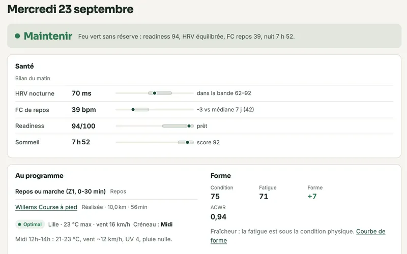
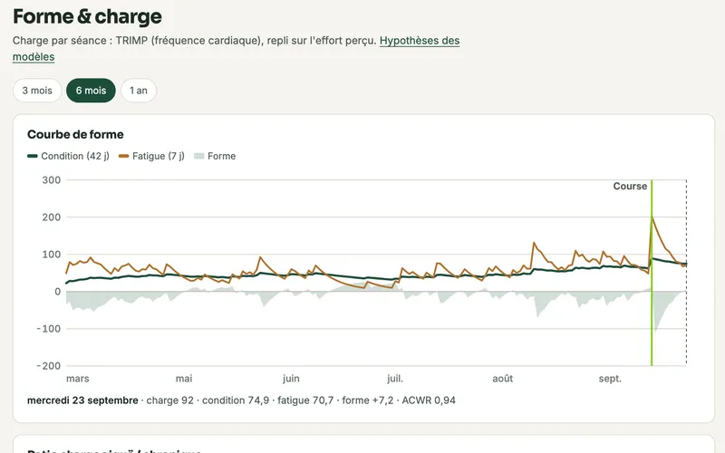
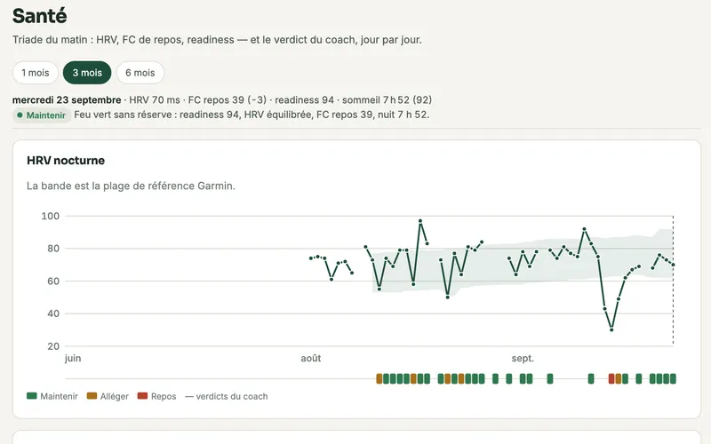
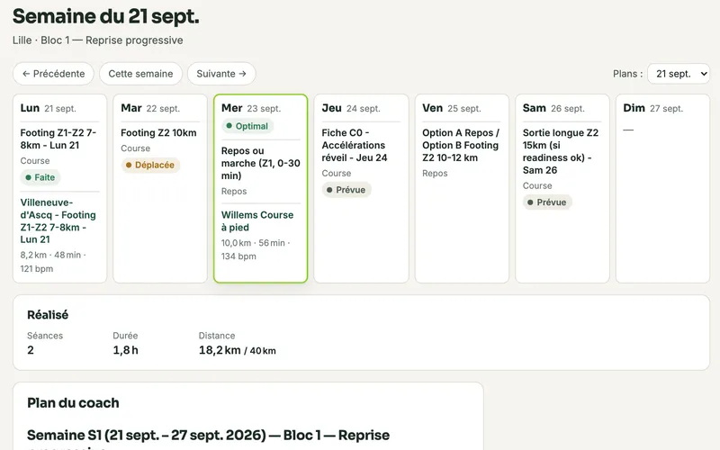
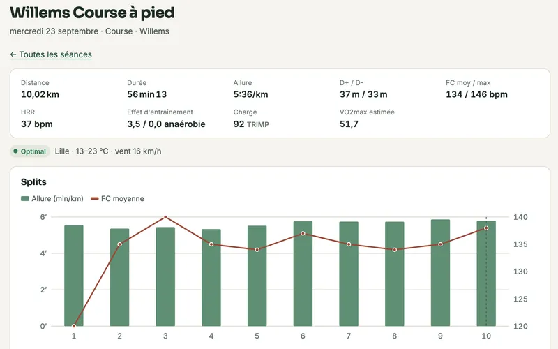
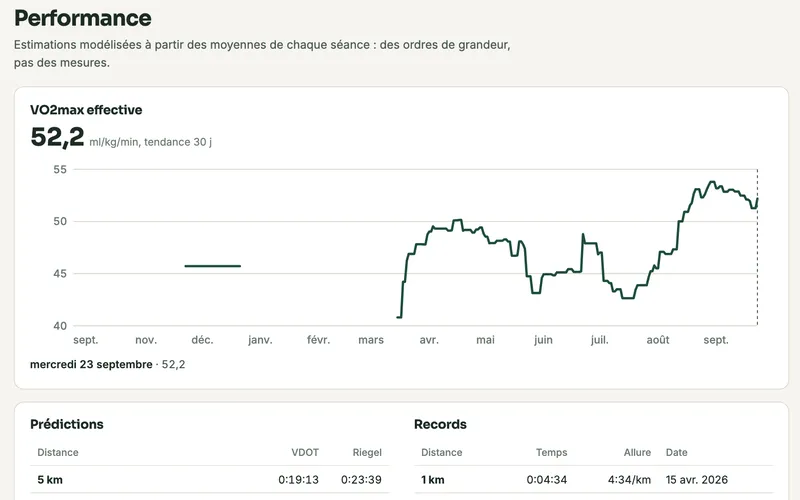
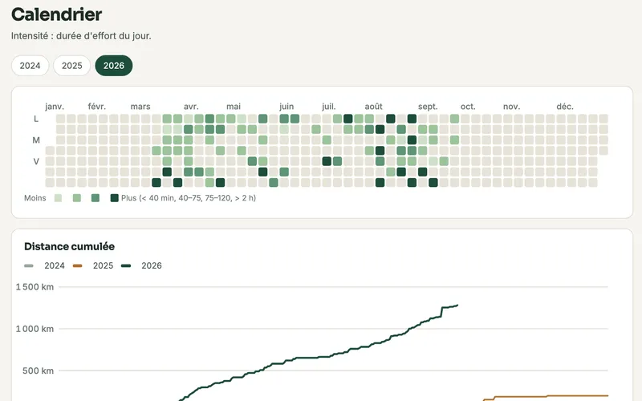
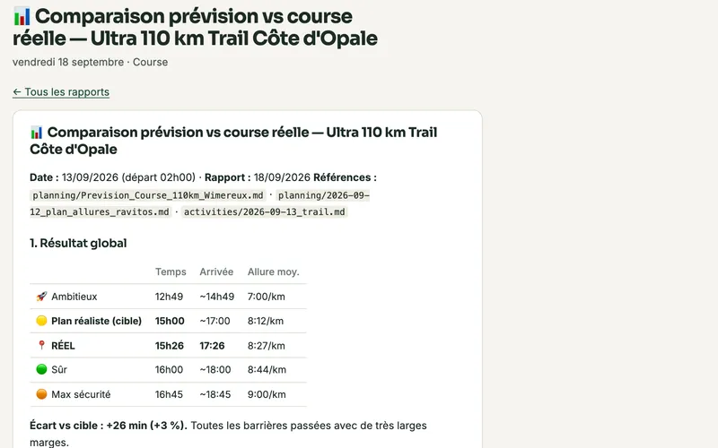

# 📊 Tableau de bord

Le coach écrit tout dans votre workspace : séances, nuits, météo, plans, rapports.
Le tableau de bord met ces fichiers **sous vos yeux** : courbe de forme, bilan du
matin, semaine planifiée face au réalisé, séances avec leurs splits, prédictions,
calendrier — et le texte du coach à côté des chiffres.


*Captures réalisées sur le workspace réel d'un athlète : la préparation et
l'ultra-trail de 110 km du 13 septembre 2026, puis la reprise.*

Il ne remplace pas la conversation avec le coach : il vous montre **ce qui est
stocké**, et c'est d'autant plus précieux quand le coach tourne sans vous — en
[mode headless](headless.md), la synchronisation de chaque matin alimente le tableau
sans que vous ouvriez une session.

## Lancer

```bash
scripts/dashboard.sh
```

Le navigateur s'ouvre sur `http://127.0.0.1:8765/`. `Ctrl+C` arrête le serveur.
Rien à installer : un serveur Python de la bibliothèque standard et une page
HTML/CSS/JS, sans npm ni étape de build.

```bash
scripts/dashboard.sh --port 9000   # autre port (défaut : [dashboard].port)
scripts/dashboard.sh --no-open     # sans ouvrir le navigateur
scripts/dashboard.sh --memory      # index en mémoire : aucun fichier écrit
scripts/dashboard.sh --rebuild     # reconstruit l'index de zéro
```

L'index se met à jour tout seul : un fichier écrit par un agent — la
synchronisation du matin, un rapport, un plan — apparaît à la requête suivante (au
plus 30 secondes), sans relancer le serveur.

!!! note "Après une mise à jour du moteur"
    Vos données apparaissent seules, mais le **code** du tableau de bord est chargé
    au démarrage. Après un `git pull` du moteur, relancez `scripts/dashboard.sh`
    (ou `systemctl --user restart arc-dashboard` pour le service décrit dans
    [Machine coach & mode headless](headless.md)) ; en conteneur, reconstruisez
    l'image ([Mettre à jour](docker.md#mettre-a-jour)).

## Visite guidée

Chaque vue répond à une question. Un clic sur une carte ouvre sa description
détaillée : comment la lire, d'où viennent ses données, que faire si elle est vide.

<div class="grid cards arc-tour" markdown>

-   [](views.md#aujourdhui)

    **[Aujourd'hui](views.md#aujourdhui)** · *Je cours, j'allège ou je me repose ?*

    Le verdict du coach et sa raison, le bilan du matin situé sur votre référence,
    la séance du jour avec sa météo.

-   [](views.md#forme-charge)

    **[Forme & charge](views.md#forme-charge)** · *Où en est ma forme ?*

    Condition, fatigue et forme sur des mois, le ratio de charge, le volume de
    chaque semaine.

-   **[Analyse](views.md#analyse)** · *Ma technique et ma durabilité progressent-elles ?*

    Polarisation 80/20, découplage aérobie, VAM, efficacité en descente,
    durabilité et segments de montée — tout ce qui vient des échantillons FIT
    (#50 ; capture d'écran à venir).

-   [](views.md#sante)

    **[Santé](views.md#sante)** · *Comment mon corps encaisse-t-il ?*

    HRV, FC de repos, readiness et sommeil en tendance, avec la frise des verdicts
    du coach jour par jour.

-   [](views.md#semaine)

    **[Semaine](views.md#semaine)** · *Qu'est-ce qui était prévu, qu'est-ce qui a été fait ?*

    Le plan du coach face au réalisé, jour par jour, statut et météo compris — et
    les semaines à venir.

-   [](views.md#detail-dune-seance)

    **[Séances](views.md#seances)** · *Comment ça s'est passé ?*

    Tout l'historique, triable ; pour chaque séance, les chiffres clés, les splits
    et l'analyse complète du coach.

-   [](views.md#performance)

    **[Performance](views.md#performance)** · *Que puis-je viser ?*

    VO2max estimée, temps prédits pour votre objectif, records au kilomètre — et
    toutes les hypothèses.

-   [](views.md#calendrier)

    **[Calendrier](views.md#calendrier)** · *Suis-je régulier ?*

    L'année en carte de chaleur et le cumul de distance comparé d'une année à
    l'autre.

-   [](views.md#rapports)

    **[Rapports](views.md#rapports)** · *Qu'en a conclu le coach ?*

    Bilans hebdomadaires, validations, comparaisons de parcours et analyses de
    course, lisibles sans ouvrir l'IDE.

</div>

S'y ajoutent la vue [Nutrition](views.md#nutrition), si le nutritionniste fait partie
du staff, et la liste des [fichiers hors contrat](views.md#fichiers-hors-contrat).
Toutes les vues suivent le thème sombre et tiennent sur un téléphone :
[captures](views.md#en-sombre-et-sur-le-telephone).

## Au quotidien

Le tableau de bord ne pose pas de questions : il montre ce que le coach a écrit.
Quelques habitudes suffisent pour qu'il soit toujours à jour.

| Quand | Ouvrir | Ce qu'on y cherche |
|---|---|---|
| **Le matin** | [Aujourd'hui](views.md#aujourdhui) | Le verdict et la séance du jour. Pas de verdict ? Demandez au coach « je cours aujourd'hui ? » : il fait le bilan, tranche et l'écrit. |
| **Après une séance** | [Séances](views.md#seances) → détail | Les splits, la FC, l'analyse du coach — une fois la séance synchronisée. |
| **Le dimanche** | [Semaine](views.md#semaine), [Forme & charge](views.md#forme-charge) | Le réalisé face au plan, la tendance de forme. Puis, avec le coach, le plan de la semaine suivante. |
| **Quand le coach planifie** | [Semaine](views.md#semaine) | Que chaque semaine du plan a bien son fichier `planning/Semaine_<lundi>.md` : un plan sur plusieurs semaines = un fichier par semaine. |
| **Avant une course** | [Performance](views.md#performance), [Rapports](views.md#rapports) | Les temps prédits, le plan de course du stratège. |

Avec une [machine coach](headless.md), la synchronisation de chaque matin fait le
premier pas pour vous : le bilan et la séance de la veille sont déjà là quand vous
ouvrez la page.

Le détail de chaque vue, captures à l'appui : [Les vues](views.md).

Il suit votre [configuration](../configuration.md) : sur route, le dénivelé disparaît
et le volume se compte en kilomètres ; avec `[health].morning_check = "off"`, la vue
Santé l'indique au lieu d'afficher des trous ; sans nutritionniste dans le staff, la
vue Nutrition n'apparaît pas ; en unités impériales, tout s'affiche en miles.

## D'où viennent les chiffres

Les agents ouvrent chaque fichier par un petit bloc de données — le
[contrat de données](../skills/workspace-data-contract.md). Le tableau de bord lit
ces blocs, jamais la prose, et les range dans une base SQLite **dérivée** :
`.arc/coach.db` dans votre workspace. Elle est jetable : la supprimer ne perd rien,
elle se reconstruit depuis vos fichiers. Elle est ignorée par git.

Les indicateurs de forme sont **calculés**, pas demandés au modèle : le coach
observe et juge, le code compte.

- **Charge d'une séance** : TRIMP de Banister (FC moyenne, FC max et FC de repos du
  profil), ou effort perçu faute de fréquence cardiaque.
- **Condition, fatigue, forme** : la condition et la fatigue sont des moyennes
  exponentielles de la charge sur 42 et 7 jours ; la forme est leur écart.
- **VO2max effective et prédictions** : estimées à partir de l'allure et de la FC
  **moyennes** des séances de course. Des ordres de grandeur, pas des mesures ; la
  vue Performance liste toutes les hypothèses.

!!! tip "Renseignez votre profil"
    Sans **FC max** ni **FC de repos de référence** dans `planning/Runner_Profile.md`,
    la charge est estimée d'après l'effort perçu. Ajoutez-les (et la FC au seuil si
    vous la connaissez) : toutes les courbes en profitent.

## Vos fichiers d'avant

Si votre workspace existait avant le contrat, le tableau de bord lit déjà vos
anciens fichiers, au mieux, et signale ceux qu'il comprend mal (« fichiers hors
contrat » dans le menu). Pour tout remettre d'aplomb : [Migrer vos fichiers](migration.md).

## Sécurité

- Le serveur n'écoute **que sur `127.0.0.1`** : rien n'est visible depuis le réseau.
  `scripts/dashboard.sh` n'offre aucun moyen d'en changer.
- Lecture seule : il n'écrit que sa propre base, dans `.arc/`.
- Une page tierce qui tenterait de l'atteindre en se faisant passer pour
  `localhost` est refusée (protection contre le *DNS rebinding*).
- Vos données ne quittent pas la machine. Seules les polices de caractères (Inter,
  Sora) sont chargées depuis Google Fonts à l'ouverture de la page ; hors ligne,
  le navigateur se rabat sur ses polices système.

Pour le consulter depuis une autre machine, passez par un tunnel SSH plutôt que
d'ouvrir un port : voir [Machine coach & mode headless](headless.md). Si votre serveur
a déjà un reverse proxy avec authentification, le tableau de bord peut s'y ranger en
conteneur, workspace en lecture seule : [Derrière un reverse proxy (Docker)](docker.md).
