# Les vues

Chaque vue répond à une question précise. Pour chacune : ce qu'elle montre, comment
la lire, **d'où viennent ses données** — et que faire quand elle reste vide.

Les captures viennent d'un vrai workspace : deux ans de fichiers (août 2024 →
septembre 2026), la préparation et le déroulé d'un ultra-trail de 110 km le
13 septembre 2026, puis le premier bloc de reprise. Date de référence : mercredi
23 septembre, dix jours après la course.

!!! tip "Partout dans le tableau de bord"
    - **Le bandeau du haut** rappelle l'objectif de `planning/active_objective.md` :
      compte à rebours (J-45), puis « Terminé il y a 10 j » une fois la course passée.
    - **Survolez un graphique** (ou touchez-le, ou utilisez les flèches du clavier) :
      la ligne sous le graphique donne les valeurs exactes du point visé.
    - **Le bouton lune** force le thème clair ou sombre ; sinon, celui du système.
    - **Tout est un lien** : une séance ouvre son détail, un rapport son texte, une
      semaine son plan. L'adresse de chaque page se partage ou se met en favori.

## Aujourd'hui

**Je cours, j'allège ou je me repose ?**

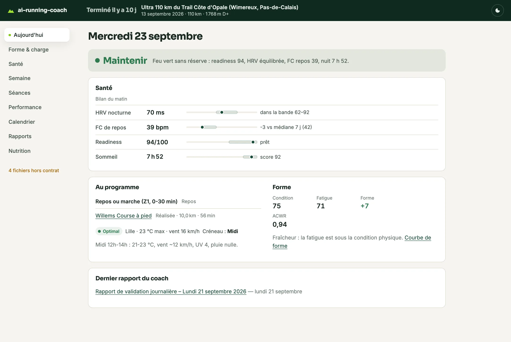

La page du matin, à ouvrir avant de lacer ses chaussures. De haut en bas :

1. **Le verdict du coach** — *Maintenir*, *Alléger* ou *Repos* — et sa raison en une
   phrase, tels qu'écrits dans le fichier santé du jour. Sans verdict ce jour-là, la
   vue rappelle le dernier, daté, plutôt que d'en inventer un.
2. **Le bilan du matin** : chaque mesure est placée sur **votre** référence, pas sur
   une norme générale — la HRV dans sa bande Garmin, la FC de repos face à sa médiane
   des 7 derniers jours (+5 bpm : à surveiller, +7 : nettement élevée, les règles
   mêmes du coach), la readiness, le sommeil et son score.
3. **Au programme** : la séance prévue par le plan de la semaine, ce qui a déjà été
   enregistré aujourd'hui, la météo du lieu d'entraînement et le créneau conseillé —
   puis, quand c'est pertinent, la tuile **Acclimatation chaleur** (#38) : nombre de
   séances outdoor à `temp_max_c` ≥ seuil (défaut 25 °C, `[health].heat_threshold_c`)
   sur les 14 derniers jours et leur durée cumulée. Affichée dès qu'il y a au moins
   une séance chaude sur la fenêtre, OU quand la météo de la course de l'objectif est
   déjà connue et chaude — le seul second critère resterait presque toujours muet en
   dehors de la semaine de course (les prévisions ne portent que sur quelques jours),
   d'où la combinaison des deux plutôt que la seule condition citée par l'issue.
   Une séance sans fichier météo ce jour-là n'est ni chaude ni froide : elle est
   ignorée du compte et signalée à part (« sans météo »). Juste en dessous, la
   tuile **Chaussures à surveiller** (#40) apparaît dès qu'une paire déclarée dans
   « Matériel & lieux » du profil (hors chaussures retirées) atteint son seuil
   d'alerte (700 km par défaut, ou celui précisé sur sa puce) — détail complet
   (toutes les paires, y compris retirées, et tout `gear_id` inconnu du profil)
   dans **Performance**.
4. **Forme** : condition, fatigue, forme et ratio de charge, avec une phrase qui les
   lit pour vous (« la fatigue est sous la condition physique »), puis une **mini
   tendance de conformité sur 4 semaines** (une barre par semaine, hauteur = % de
   séances faites) — une semaine sans plan reste une barre grise plutôt que de
   disparaître silencieusement de la série. Détail complet dans **Semaine**.
5. **Le dernier rapport du coach**, en lien.

| Alimentée par | Écrit par |
|---|---|
| `medical/<date>_health.md` (mesures, verdict) | la synchronisation du matin ; le verdict, le coach |
| `medical/<date>_meteo.md` (catégorie, créneau) | le coach, skill `weather-forecast` |
| `planning/Semaine_<lundi>.md` (séance du jour) | le coach, quand il planifie |
| `activities/`, `rapports/` | la synchronisation, le coach |

**Si c'est vide** : pas de bilan avant la synchronisation du matin
([mode headless](headless.md)) ou avant d'avoir demandé au coach son bilan matinal.
Pas de verdict tant que le coach n'a pas tranché pour la journée — demandez-lui
« je cours aujourd'hui ? ». Avec `[health].morning_check = "minimal"`, seule la
readiness apparaît ; avec `"off"`, le bloc santé disparaît — c'est voulu.

## Forme & charge

**Où en est ma condition, ma fatigue, ma forme ?**

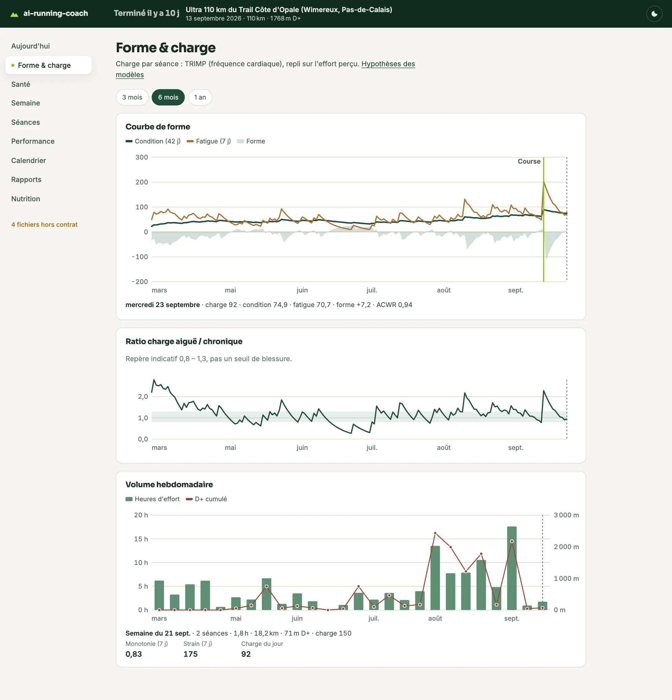

Trois graphiques, sur 3 mois, 6 mois ou un an :

- **La courbe de forme** met côte à côte votre **condition** (moyenne de charge sur
  42 jours), votre **fatigue** (7 jours) et votre **forme** (leur écart) — le modèle
  impulsion-réponse de Banister, calculé sur le TRIMP (voir
  [Marques et métriques](../marques.md)). Quand la fatigue passe sous la condition,
  la forme devient positive : vous êtes frais. Le jour de course est marqué ; on
  voit ici la fatigue bondir à plus de 200 le 13 septembre, puis la forme redevenir
  positive pendant la reprise.
- **Le ratio charge aiguë / chronique** (ACWR) et sa bande 0,8 – 1,3 — un repère
  indicatif, discuté dans la littérature, pas un seuil de blessure. Il n'est pas
  tracé tant que l'historique est trop mince pour avoir un sens.
- **Le volume hebdomadaire** : heures d'effort et D+ cumulé en trail, kilomètres sur
  route. En profil trail, la ligne affichée au survol ajoute le **km-effort ITRA**
  (km + D+/100 ; voir [Marques et métriques](../marques.md)) — à ne pas confondre
  avec l'« équivalence plat » utilisée ailleurs pour les prédictions VDOT/Riegel
  (D+ × 1,5 à 2 km). Contrairement aux heures, kilomètres et D+ affichés à côté, qui
  cumulent **toutes** les activités de la semaine, le km-effort ne compte que les
  activités de course (running, trail, randonnée, marche) : le vélo et les autres
  sports en sont exclus. Reste exprimé en kilomètres même en unités impériales
  (`[athlete].units = imperial`). En dessous, la monotonie et le *strain* de Foster
  sur 7 jours, et la charge du jour.

**Comment la lire** : une forme très négative plusieurs semaines de suite, c'est de
la fatigue accumulée ; une forme franchement positive avant une course, c'est
l'affûtage réussi. La tendance compte plus que le chiffre du jour. Il faut environ
six semaines d'historique pour que la condition ait un sens.

- **La polarisation 80/20** (#43) : une barre empilée par semaine — part du temps en
  zone FC **facile**, **modérée** et **difficile**, modèle à trois zones de Seiler
  (voir [Marques et métriques](../marques.md)). Les seuils bpm qui séparent ces trois
  paliers dépendent de la méthode de zones effective du profil (FC au seuil,
  Karvonen ou %FC max) — pas un simple découpage fixe des 5 zones affichées : pour la
  FC au seuil notamment, une zone FC affichée (« Z4 ») peut rester classée
  « modérée » plutôt que « difficile ». N'apparaît que pour les semaines ayant au
  moins une séance avec échantillons FIT ingérés (`activities/fit/*.json`, story
  #42) et un sport de la famille course à pied (course, trail, randonnée, marche —
  pas le renforcement ni le vélo) ; une semaine sans aucune séance à échantillons
  s'affiche en gris plutôt que d'être masquée — pas de donnée, pas un 0 %.

- **Le découplage aérobie (Pa:HR)** (#45) : un point par sortie longue (plus de
  90 minutes, course à pied) où la mesure est calculable — dérive de la
  fréquence cardiaque à allure ajustée à la pente (GAP, #44) constante entre
  la première et la seconde moitié de la séance, échauffement exclu
  (facteur d'efficacité EF = vitesse GAP / FC, par moitié). Un repère à 5 %
  est tracé : sous ce seuil, bonne durabilité aérobie selon le protocole de
  test de dérive de FC d'Uphill Athlete
  (<https://uphillathlete.com/aerobic-training/heart-rate-drift/>) — un
  protocole CONTRÔLÉ (allure constante, terrain maîtrisé), **pas un seuil
  validé cliniquement pour une sortie de terrain ordinaire**, jamais présenté
  comme une norme (voir [Marques et métriques](../marques.md) pour la
  terminologie Pa:HR/EF, popularisée par la marque TrainingPeaks, calcul
  public repris ici sous des noms génériques). Seule la couleur 0-5 % (bonne
  durabilité) et au-delà de 5 % (dérive marquée) est affichée ; une valeur
  négative reste neutre, jamais présentée comme meilleure qu'une dérive
  proche de zéro. N'apparaît que pour les séances éligibles : famille course
  à pied, au moins 60 minutes de mouvement, couverture FC suffisante sur
  chaque moitié (indépendamment du relief), assez de minutes réellement
  courues hors pente forte/marche, profil de pente comparable entre les deux
  moitiés, effort jugé stable sur des fenêtres glissantes de 30 secondes (voir
  `scripts/arc_decoupling.py::ASSUMPTIONS` pour la règle complète) ; une
  sortie longue non éligible (trop courte, fractionnée, relief trop
  asymétrique entre les deux moitiés, sans FC) n'apparaît simplement pas sur
  ce graphique, sans qu'aucun autre chiffre de la vue n'en soit affecté. **Une
  ascension sèche ou une sortie point-à-point avec la montée d'un côté et la
  descente de l'autre n'affiche généralement AUCUNE valeur** (relief trop
  différent entre les deux moitiés) — ce n'est pas un bug : le GAP ne corrige
  pas parfaitement l'effet du relief sur la FC, et comparer une moitié
  « montée » à une moitié « descente » mesurerait surtout le profil du
  parcours, pas une vraie dérive cardiaque. C'est le cas typique d'un
  aller-retour à un sommet unique (montée concentrée dans la première moitié,
  descente dans la seconde). Une sortie vallonnée, où montées et descentes se
  répartissent de façon comparable dans chacune des deux moitiés (plusieurs
  bosses, pas un seul flanc par moitié), reste éligible.

- **La VAM (vitesse ascensionnelle)** (#46) : un point par séance de la
  famille course à pied où au moins une montée a été détectée — gain
  d'altitude / durée de la meilleure montée de la sortie (VAM temps écoulé, la
  définition la plus simple à interpréter ; voir `scripts/arc_climb.py::ASSUMPTIONS`
  pour la seconde VAM, « temps de mouvement », qui exclut les arrêts).
  L'indicateur lui-même est une simple division (gain / durée), sans modèle
  propriétaire à approximer — voir [Marques et métriques](../marques.md) pour
  son origine historique en cyclisme. Une montée n'est comptée que si son
  gain net atteint 50 m ET sa pente moyenne atteint 5 % (les deux critères,
  **configurables** — `[metrics].climb_min_gain_m`/`climb_min_grade_pct` dans
  `config/workspace.toml`, à adapter au terrain habituel), jamais à travers un
  trou de signal (montre en veille) ; deux montées séparées par un petit
  replat sont fusionnées en une seule (creux de moins de 10 m, ou moins de
  12,5 % du plus petit des deux gains adjacents sur une grosse montée, sur
  moins de 200 m de distance dans tous les cas). Sous les deux repères
  « Meilleure VAM 10/20 min »
  (comme une courbe de puissance en cyclisme) : le plus grand gain net observé
  sur une fenêtre d'au moins 10, puis 20 minutes, glissée à l'intérieur d'une
  seule montée. Une sortie sans montée détectée (parcours plat) n'apparaît
  simplement pas sur ce graphique. La fiche d'une séance individuelle
  (« Séances » → une séance) détaille chaque montée (bornes, D+, pente
  moyenne, classe de pente, durée, VAM) dans son propre tableau.

- **L'efficacité en descente** (#47) : UNE SÉRIE PAR CLASSE de pente descendante
  (sélecteur au-dessus du graphique, comme les périodes de la courbe de forme) —
  jamais une moyenne toutes classes confondues, l'indicateur n'ayant de sens qu'« à
  pente égale » (voir `scripts/arc_descent.py::ASSUMPTIONS["indicator"]`). Chaque
  point est la moyenne, pondérée par le temps, du ratio PAR ÉCHANTILLON vitesse GAP
  / allure GAP de référence de la séance — la référence est l'allure GAP mesurée
  sur les sections RÉELLEMENT PLATES de CETTE sortie (au moins 5 minutes), ou à
  défaut sur tout ce qui n'est PAS une forte descente (repli, la source effective
  est affichée) — **jamais l'allure GAP de toute la séance**, qui se contaminerait
  avec l'effort des descentes elles-mêmes et ferait varier l'efficacité d'une même
  descente selon le reste du parcours. Un repère pointillé à 1,00× marque l'allure
  que prédirait le modèle de Minetti à effort métabolique constant. **Ce modèle est
  connu pour surestimer le bénéfice des fortes descentes en conditions réelles de
  trail, de façon NON MONOTONE** (voir [Marques et métriques](../marques.md)) : une
  efficacité nettement sous 1,00× sur les classes les plus raides est donc
  **normale**, pas la preuve d'une mauvaise descente — seule sa **tendance dans le
  temps, à pente égale**, est exploitable. Classes de pente descendante : les trois
  classes intermédiaires -5/-10 %, -10/-15 %, -15/-20 % sont le miroir direct de la
  VAM (#46) ; au-delà, DEUX classes distinctes -20/-30 % et < -30 % (jamais un
  panier unique, le coût du modèle n'étant pas monotone en descente) ; une classe
  dont le temps de mouvement (2 min) ou la distance (300 m) reste sous le seuil sur
  cette séance n'apparaît simplement pas (critère d'acceptation de #47). La fiche
  d'une séance individuelle détaille chaque classe qualifiante (pente moyenne
  réellement rencontrée, allure, distance, durée, efficacité) dans son propre
  tableau.

- **La durabilité** (#48) : un point par sortie longue (plus de 90 minutes de
  mouvement, la même borne que la tendance de découplage) éligible — fade GAP
  et fade EF entre le dernier et le premier tiers de la sortie (temps de
  mouvement, échauffement de 10 minutes exclu en premier, puis découpage en
  trois tiers égaux), en pourcentage. Une valeur **positive** signale un
  ralentissement en fin de sortie (baisse de performance, prédicteur direct de
  la tenue en ultra) ; négative ou nulle, pas de baisse mesurable, voire un
  négative splitting. Repère à 0 %, jamais un seuil validé cliniquement — même
  prudence que le découplage aérobie (#45), dont la durabilité partage
  l'esprit et les règles d'éligibilité (couverture FC ≥ 80 % et au moins 10
  minutes de course réellement exploitable sur le premier ET le dernier
  tiers, pente comparable entre les deux, pentes fortes et marche exclues du
  calcul mais jamais de la sortie entière), à une différence près : **aucune**
  règle d'effort stable n'est appliquée — le fade de fin de sortie est
  précisément ce que ce KPI cherche à détecter, une sortie qui ralentit
  nettement en fin de parcours ne doit jamais être écartée pour cette raison
  (voir `scripts/arc_durability.py::ASSUMPTIONS`). Une sortie longue non
  éligible n'apparaît simplement pas sur ce graphique. La fiche d'une séance
  individuelle affiche le fade GAP (et le fade EF) comme un fait de séance,
  aux côtés du découplage aérobie.

| Alimentée par | Calcul |
|---|---|
| `activities/*.md` (durée, FC moyenne, effort perçu) | `scripts/arc_metrics.py` : TRIMP, ou effort perçu sans FC |
| `planning/Runner_Profile.md` (FC max, FC de repos) | indispensables au TRIMP |
| `activities/fit/*.json` (échantillons ingérés) | temps en zone FC → polarisation 80/20 ; GAP → découplage aérobie/EF ; montées détectées → VAM ; classes de pente descendante → efficacité en descente ; premier/dernier tiers → durabilité (fade GAP/EF) |

**Si les courbes sont plates ou bizarres** : renseignez la FC max et la FC de repos
de référence du profil. Sans elles, la charge vient de l'effort perçu seul.

## Santé

**Comment mon corps encaisse-t-il ?**

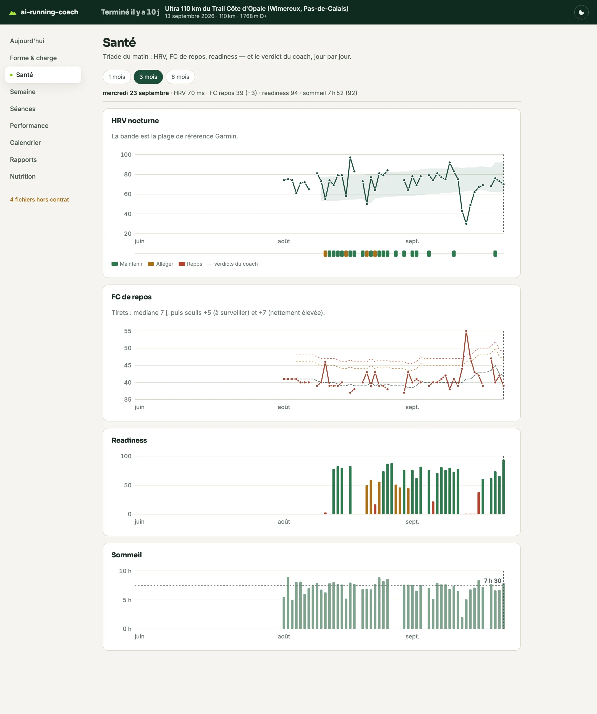

Les tendances du bilan matinal, sur 1, 3 ou 6 mois :

- **HRV nocturne** dans sa bande de référence Garmin (zone pleine), avec sa courbe
  lissée en tirets — moyenne glissante 7 jours de ln(HRV) comparée à une **référence
  personnelle** 60 jours ± 0,5 écart-type calculée localement (largeur de bande :
  Plews, Laursen & Buchheit 2013 ; passage au log et CV du lnRMSSD hebdomadaire :
  Plews et al. 2012 — Kiviniemi et al. 2007 n'est qu'un précédent de l'entraînement
  guidé par une bande individuelle, pas la source de cette largeur ni de ce CV ;
  détail complet dans `ASSUMPTIONS["hrv_baseline"]` de `scripts/arc_metrics.py`).
  Quand Garmin ne fournit pas de bande, cette référence personnelle prend sa place —
  y compris hors tableau de bord, via `python3 scripts/arc_index.py hrv-baseline`.
  Sous 30 jours d'historique de référence, le statut reste « en construction » plutôt
  que d'afficher une estimation bruitée. Uniquement calculé et affiché en
  `[health].morning_check = "full"` : en `minimal`, seule la readiness est exposée.
  Juste dessous, **la frise des verdicts du coach**, jour par
  jour (vert *Maintenir*, orange *Alléger*, rouge *Repos*). On y lit ici le repos
  imposé au lendemain de l'ultra, puis le feu vert de la reprise.
- **FC de repos**, avec sa médiane 7 jours et les seuils +5 / +7 qui la suivent : le
  pic post-course à 55 bpm les franchit nettement, puis la FC redescend.
- **Readiness**, colorée par niveau, et **sommeil** face au besoin configuré (profil
  → « Besoin de sommeil », sinon 7 h 30 par défaut).
- **Dette de sommeil sur 7 jours** (#37, `[health].morning_check = "full"` uniquement) :
  somme, sur les nuits mesurées des 7 derniers jours, du manque par rapport à ce même
  besoin — une nuit sans mesure n'est jamais comptée comme un manque de 0 h, et la
  valeur n'est rendue qu'à partir de 4 nuits mesurées sur les 7 (sinon aucune barre ce
  jour-là). Les nuits excédentaires ne compensent pas un déficit d'une autre nuit
  (détail et justification dans `ASSUMPTIONS["sleep_debt"]` de `scripts/arc_metrics.py`).
  Seuils d'affichage indicatifs (pas médicaux, même statut que la zone ACWR) :
  **5 h cumulées → à surveiller**, **10 h → nettement** (`SLEEP_DEBT_WARN_S`/
  `SLEEP_DEBT_ALERT_S`, servis par `/api/health` → `thresholds.sleep_debt_warn_h`/
  `sleep_debt_alert_h`, jamais recalculés côté JS). Même calcul repris dans la
  tuile « Aujourd'hui » et disponible hors tableau de bord via
  `python3 scripts/arc_index.py sleep-debt`.

**Comment la lire** : un point isolé ne dit rien ; deux ou trois jours d'affilée
hors de la bande, ou au-dessus du seuil +5, oui. C'est exactement ce que le coach
regarde avant de poser son verdict.

| Alimentée par | Écrit par |
|---|---|
| `medical/<date>_health.md` | la synchronisation (bilan matinal) ; le verdict, le coach |

**Si c'est vide** : `[health].morning_check = "off"` désactive le bilan — la vue le
dit au lieu d'afficher des trous. Un jour sans verdict dans la frise est un jour où
le coach n'a pas tranché : rien n'est inventé.

## Semaine

**Qu'est-ce qui était prévu, qu'est-ce qui a été fait ?**

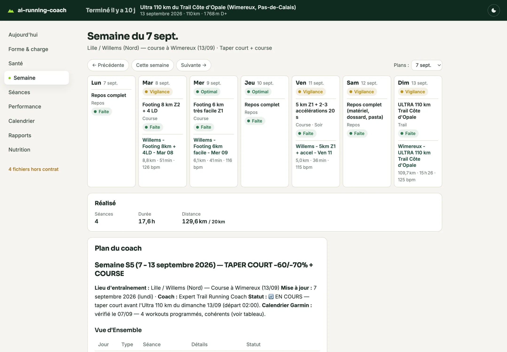

Le plan de la semaine face au réalisé. Pour chaque jour :

- **les séances prévues** et leur statut — *Prévue*, *Faite*, *Déplacée*, *Manquée*,
  *Annulée* ; ici, le footing du mardi a été couru le mercredi ;
- **la catégorie météo** du jour (*Optimal*, *Vigilance*…) quand une prévision existe ;
- **les séances réellement enregistrées**, sous le plan : un clic ouvre leur détail.

En dessous, **le réalisé face à la cible** de la semaine (18,2 km sur 40 visés), puis
**la conformité** — le KPI de l'épopée #20 (story #33) : % de séances faites, ratio
durée réalisée/planifiée, ratio D+ réalisé/planifié (route : ratio absent, pas de D+
significatif), le tout aussi par intensité (*Facile* : récupération, endurance ;
*Qualité* : tempo, seuil, VO2max, course ; *Autre* : renforcement et toute intensité
non classée, pour que Facile + Qualité + Autre reconstitue toujours le total). Les
séances de **repos**, **annulées** et **déplacées** sont retirées du calcul (elles ne
comptent ni en séance faite ni en manquée), les séances des jours pas encore passés
de la semaine en cours ne sont jamais comptées manquées, et une séance du jour même
sans activité encore enregistrée est **en attente**, pas manquée — le décompte ne se
fige qu'à la fin de la journée. Une semaine sans aucune séance planifiée (hors repos)
n'affiche aucun pourcentage plutôt qu'un 0 % trompeur. Puis **le texte du plan** tel
que le coach l'a écrit. *Précédente* / *Suivante* naviguent d'une semaine à l'autre ;
la liste **Plans** saute directement aux semaines qui ont un plan.

!!! note "Comment une séance prévue est rapprochée du réalisé"
    Une séance de repos (`sport` ou `intensity` valant `rest`) est hors sujet pour ce
    KPI et n'entre dans aucun calcul : sans cette exclusion, une semaine des plans
    hérités (qui classent chaque « Repos » du tableau en `sport = rest` sans statut)
    tombait à 50 % de conformité alors que tout avait été fait.

    Le statut écrit dans le plan (`done`, `missed`, `moved`, `cancelled`) prime
    toujours — et les séances `done` explicites réservent leur activité avant que les
    séances sans statut ne piochent dans ce qui reste, pour qu'une séance non
    résolue ne puisse jamais « voler » l'activité d'une séance déjà validée du même
    jour. Sans statut, ou avec `planned` sur une date déjà passée, la séance est
    comparée aux activités restantes du même jour de sport compatible (course sur
    route, trail, randonnée et marche interchangeables, de même pour les variantes de
    vélo) : une activité correspondante fait compter la séance comme faite, son
    absence comme manquée — sauf le jour même, où l'absence d'activité est encore
    « en attente », pas manquée.

    Une séance `cancelled` est exclue du calcul quel que soit le motif — le contrat
    de données n'a pas de champ pour distinguer une annulation médicale d'une autre
    (voir la docstring de `scripts/arc_metrics.py::week_compliance`). Une séance
    `moved` est également exclue : rien dans le contrat n'indique sa nouvelle date ;
    si le coach a écrit une séance distincte au jour réel, celle-ci compte pour
    elle-même. Une séance `done` explicite sans activité chiffrée en face (fichier
    pas encore synchronisé) compte comme faite, mais reste hors des ratios durée/D+
    des deux côtés — un ratio à 0 % serait aussi trompeur qu'optimiste.

La même vue montre les semaines à venir — ici un bloc de force planifié un mois plus
tard, avec les fiches de renforcement et le home trainer :

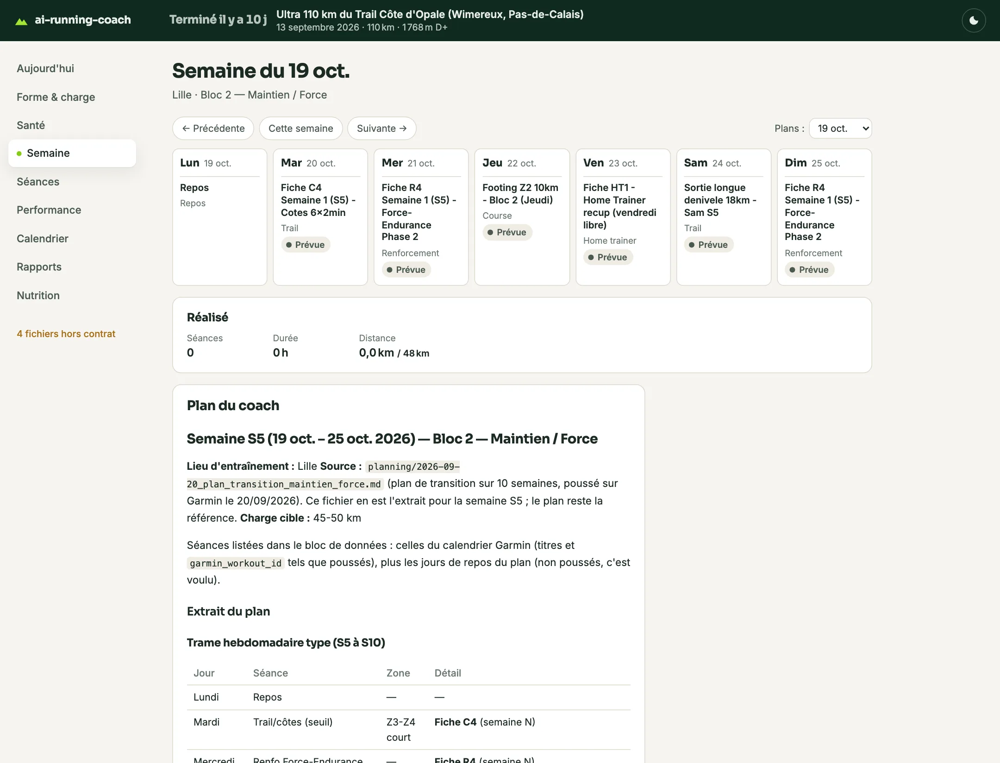

| Alimentée par | Écrit par |
|---|---|
| `planning/Semaine_<lundi>.md` : **un fichier par semaine**, nommé d'après son lundi (`Semaine_2026-09-21.md`) | le coach, quand il planifie ou pousse le plan sur Garmin |
| `activities/*.md` (le réalisé) | la synchronisation |
| `medical/<date>_meteo.md` | le coach, skill `weather-forecast` |

!!! warning "« Pas de plan de semaine au contrat pour ces dates »"
    La vue ne lit que les fichiers `planning/Semaine_<lundi>.md`. Un plan de
    plusieurs semaines rangé dans un seul fichier (« plan de transition sur
    10 semaines ») reste invisible, et n'apparaît même pas dans les fichiers hors
    contrat. Demandez au coach d'en écrire **un fichier par semaine** — dix semaines,
    dix fichiers —, chacun avec son bloc de données : séances datées, et
    `garmin_workout_id` quand elles sont sur le calendrier Garmin. Le plan d'origine
    reste la référence ; chaque fichier semaine y renvoie.

## Séances

**Qu'est-ce que j'ai fait, et comment ça s'est passé ?**

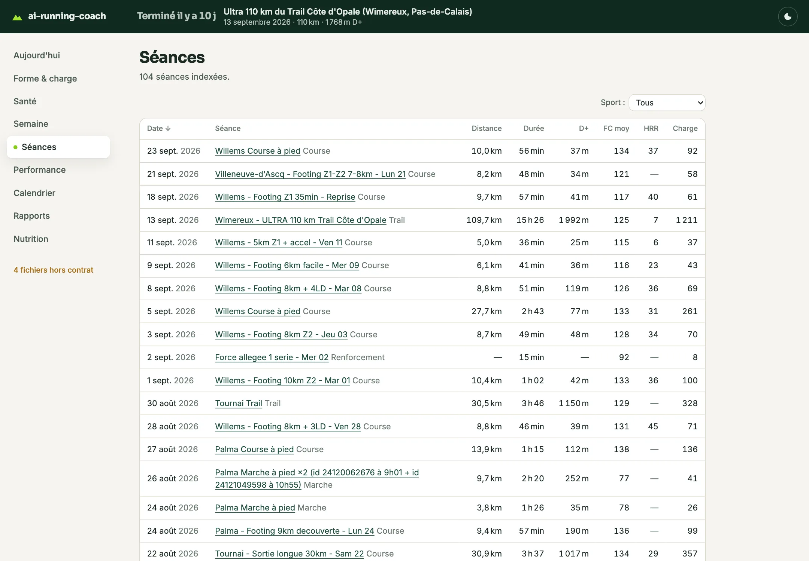

Tout l'historique : date, distance, durée, D+ (ou allure sur route), FC moyenne, HRR
et charge. Chaque colonne se trie ; le filtre isole un sport. Une séance lue dans un
fichier antérieur au contrat porte la mention **approx.** ; une charge estimée faute
de fréquence cardiaque et d'effort perçu, un astérisque.

### Détail d'une séance

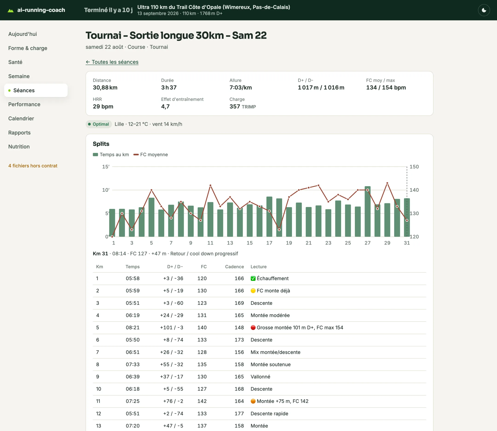

- **Les chiffres clés** : distance, durée, allure, D+ / D-, FC moyenne et max, **HRR**
  (récupération cardiaque — « non mesuré » avec sa raison quand Garmin ne l'a pas),
  effet d'entraînement, charge, VO2max estimée quand la séance s'y prête, et le
  **découplage aérobie (Pa:HR)** (#45, facteur d'efficacité EF en complément) quand la
  séance est éligible (sortie course à pied d'au moins 60 minutes de mouvement, à
  effort stable — voir la section « Découplage aérobie » de « Forme & charge »
  ci-dessus pour la méthode complète) ; absent sinon, jamais une valeur à zéro. La
  **durabilité (fade GAP dernier tiers)** (#48, fade EF en complément) apparaît de la
  même façon, quand la sortie est éligible (plus de 90 minutes de mouvement, voir la
  section « Durabilité » de « Forme & charge » ci-dessus) ; absente sinon.
- **La météo du jour**, si une prévision a été enregistrée.
- **Les splits** : un graphique allure + FC, puis le tableau complet — temps, D+ / D-,
  FC, cadence et la lecture du coach pour chaque kilomètre quand il en a écrit une.
  Quand la séance a des échantillons FIT ingérés, une seconde courbe **GAP**
  (allure ajustée à la pente, #44 — voir [Marques et métriques](../marques.md))
  s'ajoute au graphique et au tableau, à côté de l'allure brute : elle « aplatit »
  mentalement les côtes pour comparer une allure de montée à une allure de plat.
  Réservée aux sports de la famille course à pied avec échantillons FIT ; absente
  sinon (jamais une valeur à zéro).
- **Les montées** (#46, VAM) : un tableau, une ligne par montée détectée (bornes en
  kilomètres, distance, D+, pente moyenne et sa classe, durée, VAM temps
  écoulé/temps de mouvement), plus la VAM moyenne par classe de pente en pied de
  tableau. Réservé aux sports de la famille course à pied avec échantillons FIT ;
  une séance sans montée détectée (parcours plat, D+ ou pente sous le seuil de
  détection) affiche la section avec un message plutôt que la masquer — pour
  distinguer « pas de montée sur cette sortie » d'un bug d'affichage.
- **L'efficacité en descente** (#47) : un tableau, une ligne par classe de pente
  descendante qualifiante (pente moyenne réellement rencontrée, allure, distance,
  durée de mouvement, indicateur d'efficacité — voir la vue « Forme & charge »
  ci-dessus et `scripts/arc_descent.py::ASSUMPTIONS` pour la méthode complète), plus
  l'allure GAP de référence utilisée en pied de tableau — sections réellement
  plates de CETTE séance, ou à défaut tout ce qui n'est pas une forte descente
  (repli, la source est indiquée). Réservé aux sports de la famille course à pied
  avec échantillons FIT ; une séance sans classe qualifiante affiche la section
  avec un message explicite plutôt que la masquer
  (contrairement aux montées, l'absence est ici TOUJOURS documentée — critère
  d'acceptation de #47).
- **Les zones FC** (#43) : une barre empilée du temps passé dans chacune des 5 zones,
  avec les bornes intérieures (bpm, ex. « Z1 < 146 · Z2 146-155 · … · Z5 ≥ 172 ») et
  la méthode effective (FC au seuil, Karvonen ou %FC max — voir
  [Marques et métriques](../marques.md)), plus la polarisation 80/20 de la séance,
  restreinte aux sports de la famille course à pied. Réservé aux sports course à
  pied (course, trail, randonnée, marche). Si le profil ne permet de calculer aucune
  zone (FC max/repos/seuil manquantes, ou méthode forcée par
  `[athlete].hr_zones` mais incomplète), la raison est affichée explicitement au lieu
  de masquer la section ; sans échantillons FIT ingérés pour cette séance, les bornes
  s'affichent quand même, sans barre.
- **L'analyse complète du coach**, rendue telle qu'il l'a écrite, tableaux compris ;
  le chemin du fichier source est rappelé en bas.

Les splits sont les **tours Garmin**. En course libre, un tour = un kilomètre. Sur une
séance structurée, un tour suit les étapes de la séance : 500 m, 676 m… Le graphique
trace alors l'**allure** de chaque tour (le temps ramené au kilomètre), et le tableau
ajoute distance et allure. Le reliquat de quelques mètres à la fin d'une sortie n'est
pas tracé ; il reste dans le tableau.

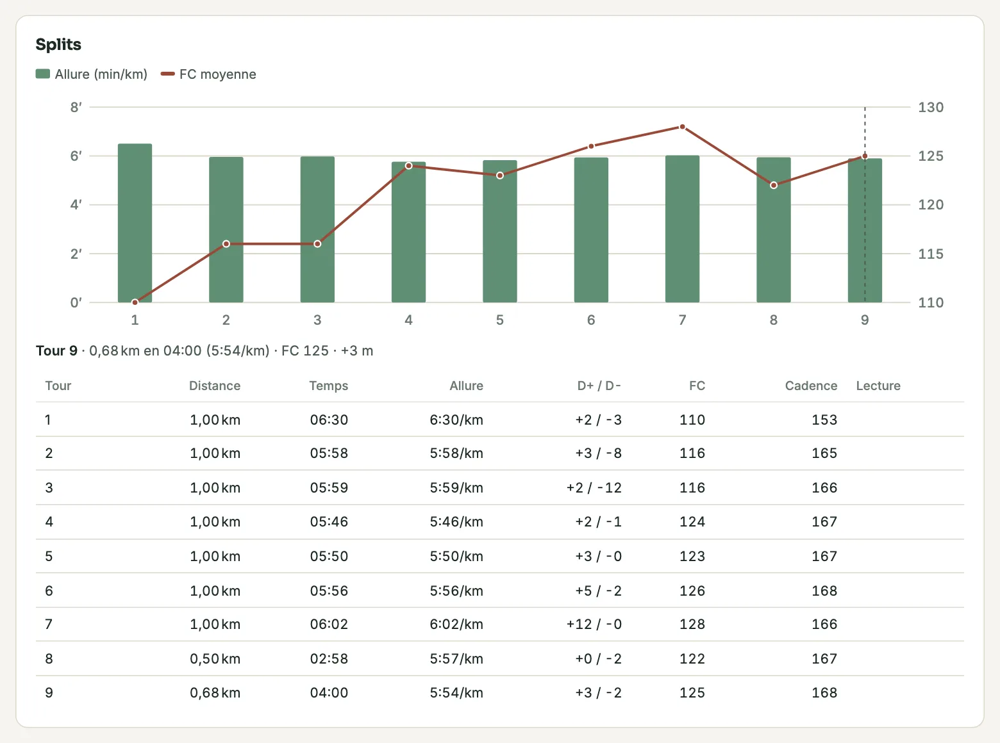

Sur une longue sortie, le graphique devient le profil de la course : ici les 110 km
de l'ultra, les ravitaillements lisibles en creux de FC et en pics d'allure.

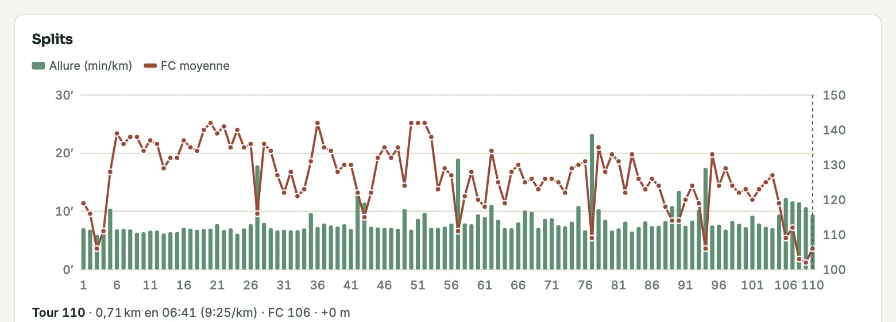

| Alimentée par | Écrit par |
|---|---|
| `activities/<date>_<sport>.md` : bloc de données (`splits`, `garmin_activity_id`) et analyse | la synchronisation |

**Pas de graphique ?** Le bloc de la séance n'a pas de splits : fichier ancien,
migré sans eux. Voir [Compléter les splits depuis Garmin](migration.md#completer-les-splits-depuis-garmin).
Le renforcement, le vélo d'intérieur ou l'elliptique n'ont pas de tours au
kilomètre : pas de graphique, c'est normal.

## Performance

**Quel est mon niveau, et que puis-je viser ?**

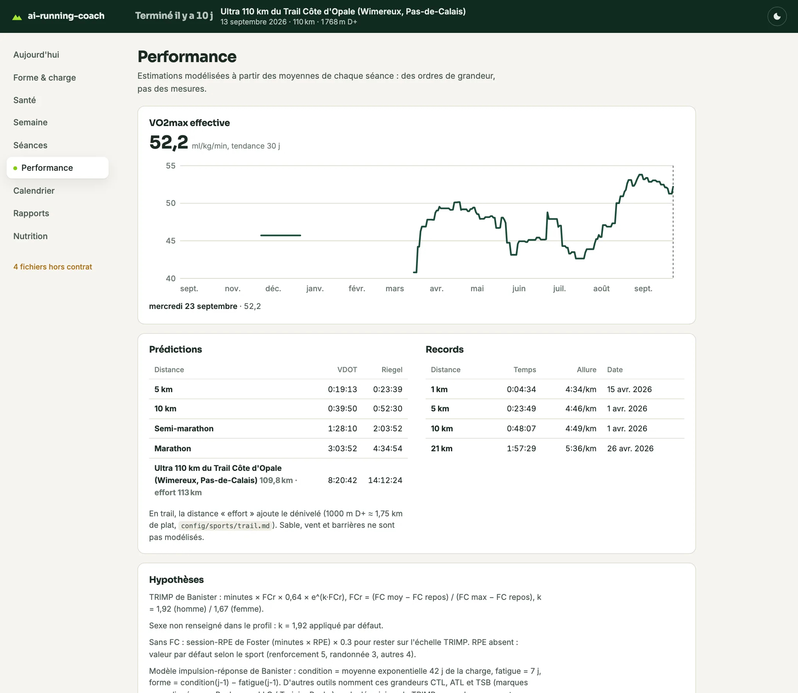

- **VO2max effective**, tendance sur 30 jours, estimée sur les séances de course
  qualifiantes (20 min à 3 h, au-dessus de 70 % de la FC max, sans marche).
- **Prédictions** du 5 km au marathon, et pour votre objectif : par le VDOT de
  Daniels et par la formule de Riegel. En trail, la distance « effort » ajoute le
  dénivelé (1 000 m D+ ≈ 1,75 km de plat).
- **Records** sur des fenêtres de kilomètres consécutifs (1, 5, 10, 21 km) : seuls
  les tours d'environ 1 km comptent.
- **Matériel** (#40) : kilométrage cumulé de chaque paire déclarée dans « Matériel &
  lieux » du profil (course et randonnée seulement), une ligne « à surveiller »
  au-delà du seuil d'alerte, les paires retirées affichées en grisé sans jamais
  alerter, et une ligne « inconnue » par `gear_id` vu sur une séance mais absent du
  profil — jamais masqué silencieusement.
- **Hypothèses** : toutes les formules et leurs limites, en clair.

**Comment la lire** : ce sont des ordres de grandeur, calculés sur l'allure et la FC
*moyennes* de chaque séance — pas une mesure de laboratoire. Deux estimations qui
divergent disent que le terrain ou la forme du jour pèsent.

| Alimentée par | Calcul |
|---|---|
| `activities/*.md` (course et trail : allure, FC, splits) | `scripts/arc_metrics.py` |
| `planning/Runner_Profile.md`, `planning/active_objective.md` | FC max ; distance et D+ de l'objectif |

## Calendrier

**Suis-je régulier ?**

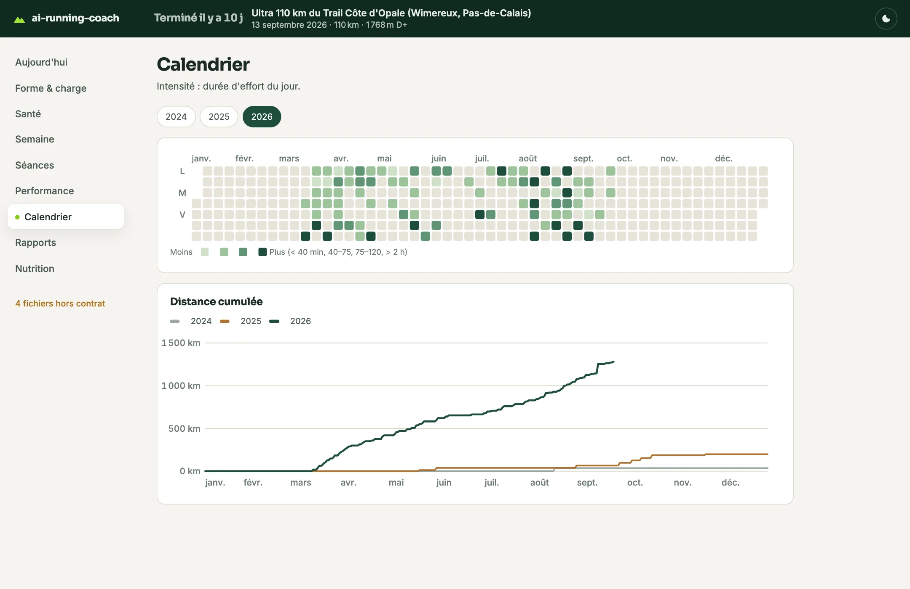

L'année en carte de chaleur — plus la case est foncée, plus la durée d'effort du jour
est longue — et la **distance cumulée**, comparée d'une année à l'autre. Les boutons
d'année remontent l'historique.

## Rapports

**Qu'est-ce que le coach en a conclu ?**

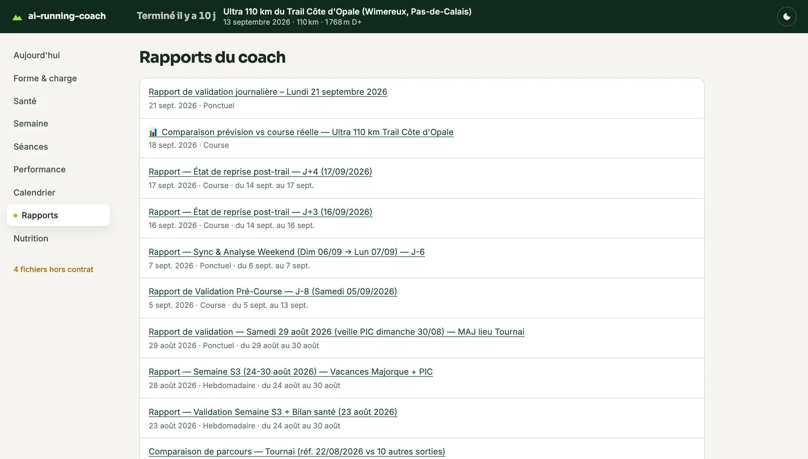

Les rapports du coach — bilans hebdomadaires, validations du jour, comparaisons de
parcours, analyses de course —, du plus récent au plus ancien, avec leur type et leur
période. Un clic les rend lisibles, tableaux compris ; ici, la comparaison entre la
prévision et le déroulé réel de l'ultra :

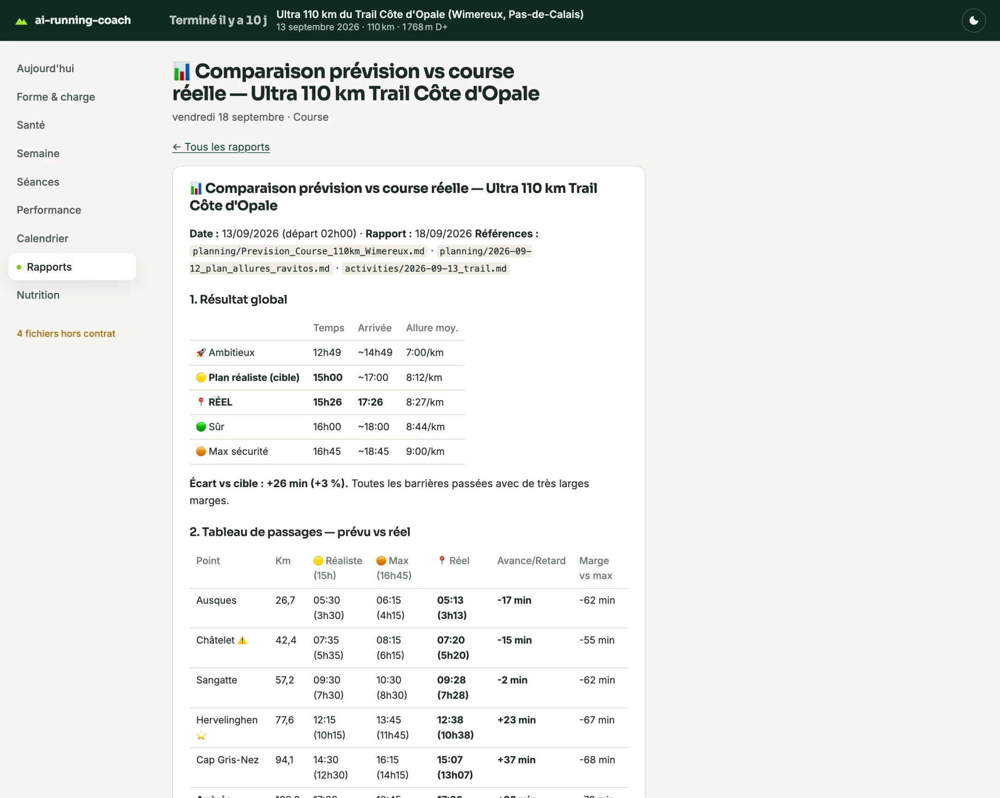

| Alimentée par | Écrit par |
|---|---|
| `rapports/*.md` | le coach |

## Nutrition

**Mon poids et mes apports suivent-ils ?**

Un graphique de poids (#36) — points quotidiens, moyenne mobile 7 jours et cible — puis
un tableau jour par jour : poids et poids cible, apports déclarés, dépense Garmin,
glucides / protéines / lipides. Il n'y a pas de connexion MyFitnessPal : les apports
viennent de ce que vous dites au nutritionniste, qui les consigne.

Le poids affiché fusionne deux sources qui peuvent toutes deux exister le même jour :
`medical/<date>_health.md` (pesée du bilan matinal) et `nutrition/<date>_nutrition.md`
(sans garantie d'horaire). La mesure du matin gagne toujours ; jamais de moyenne entre
les deux. Deux fichiers de la MÊME source pour la même date (doublon santé, ou doublon
nutrition) : le `source_path` le plus grand par ordre alphabétique gagne — une règle
arbitraire mais déterministe et documentée (`ASSUMPTIONS["weight_merge"]`), faute d'heure
de mesure dans le contrat pour départager autrement. Sous trois jours pesés sur les sept
derniers, la moyenne 7 j n'est pas affichée plutôt que de montrer une valeur bruitée ; la
moyenne et l'écart à la cible affichés sont toujours ceux du jour même — jamais la dernière
valeur non nulle trouvée plus tôt dans l'historique — et portent leur propre date (« au
25 sept. ») pour qu'une valeur ancienne ne se fasse jamais passer pour la valeur du jour.
La pente sur 4 semaines (kg/semaine) demande au moins cinq jours pesés ET un écart d'au
moins 14 jours entre la première et la dernière pesée de la fenêtre — quelques pesées
groupées sur deux ou trois jours ne donnent pas une tendance fiable sur 4 semaines. Ce sont
des chiffres, jamais un avis sur ce qu'il faudrait en faire. En unités impériales
(`[athlete].units = "imperial"`), le poids s'affiche en livres.

| Alimentée par | Écrit par |
|---|---|
| `nutrition/<date>_nutrition.md` (valeurs chiffrées) | le nutritionniste |
| `medical/<date>_health.md` (poids du bilan matinal) | le coach / la synchronisation santé |

**Glucides & sudation, sorties longues (#41).** Un point par sortie longue
(`duration_s` > 90 min) des 12 dernières semaines glissantes : glucides ingérés par
heure d'effort (`carbs_g` / durée), et taux de sudation quand la séance a été pesée
avant/après (`sweat_rate_l_h`, dérivé à l'indexation — voir plus haut). Une bande
60-90 g/h rappelle le repère généraliste des plans de course, à titre documentaire
seulement, pas une cible normative. Le débit maximal observé sur la fenêtre — le seul
repère de tolérance dont dispose le workspace, faute d'un champ de trouble digestif
au contrat — est affiché en chiffre et sert de plafond (+ marge de progression
documentée) à `course-strategist` lors d'un plan de course : jamais un pari sur
60-90 g/h par défaut si l'athlète n'a encore rien démontré à l'entraînement. Sans
aucune sortie longue chiffrée, la section ne s'affiche pas — ce n'est pas une
absence de données à signaler comme une erreur, juste un entraînement digestif qui
n'a pas encore commencé.

| Alimentée par | Écrit par |
|---|---|
| `activities/<date>_*.md` (`carbs_g`, `weight_pre_kg`/`weight_post_kg`) | le nutritionniste / le coach, déclaration de l'athlète pendant la séance |

**Si c'est vide** — « Pas encore de suivi chiffré » : les fichiers `nutrition/` ne
contiennent pas encore de valeurs (une liste de courses ou un plan de ravitaillement
n'en contiennent pas). Sans `nutritionist` dans `[agents].enabled`, la vue
n'apparaît pas du tout.

## Fichiers hors contrat

**Qu'est-ce que le tableau de bord lit mal ?**

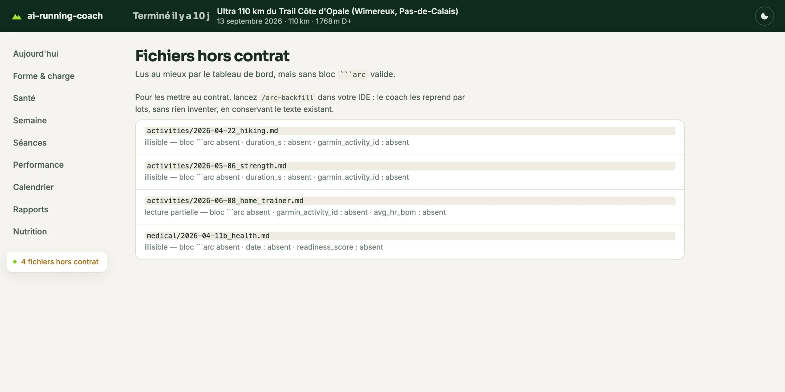

Les fichiers sans bloc de données, avec un bloc invalide, ou illisibles — chacun avec
ce qui lui manque. Le lien n'apparaît dans le menu que s'il en reste. Pour les
reprendre : [Migrer vos fichiers](migration.md). Les fichiers écartés à dessein (une
séance prescrite jamais courue, un doublon) peuvent y rester : c'est une liste de
contrôle, pas une erreur.

## En sombre, et sur le téléphone

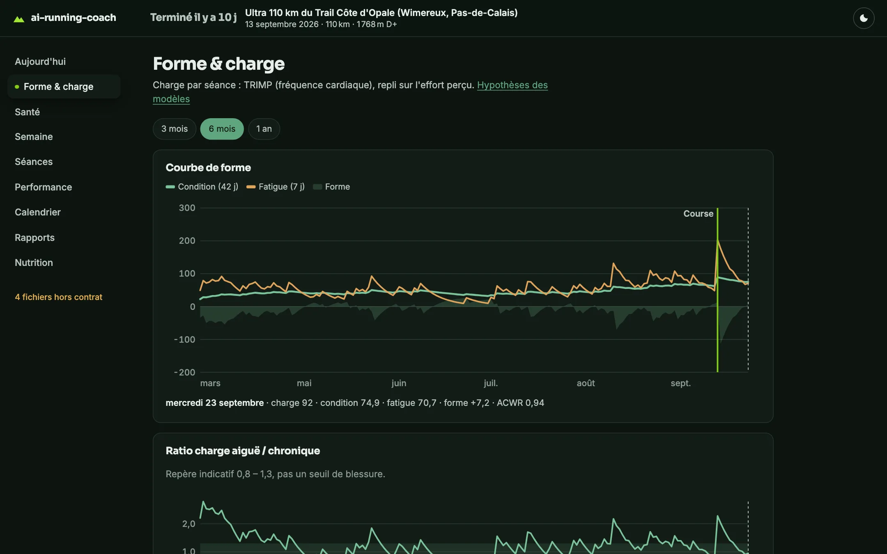

Le tableau suit le thème clair ou sombre du système ; le bouton lune force l'un ou
l'autre, un lien avec `?theme=dark` ou `?theme=light` aussi. Sur un téléphone, le
menu se replie et les graphiques s'adaptent : c'est la vue à ouvrir le matin, depuis
la [machine coach](headless.md) ou [derrière votre reverse proxy](docker.md).

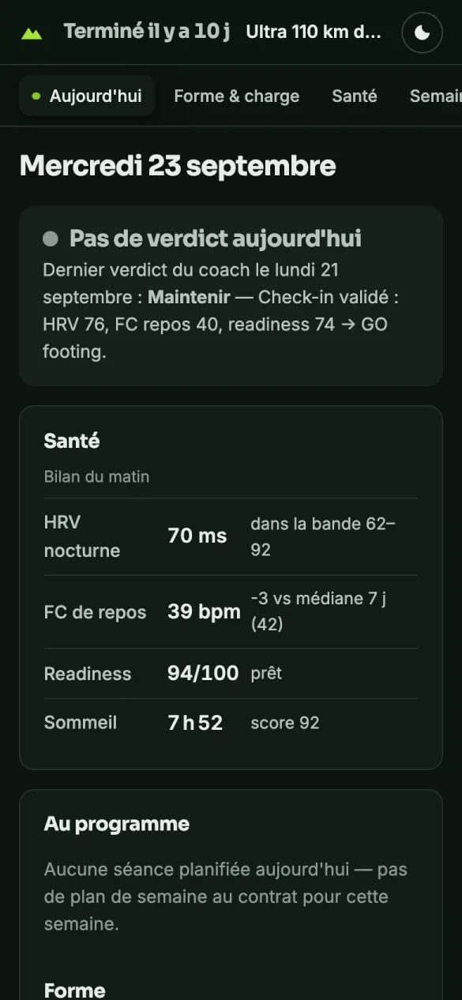{ width="260" }
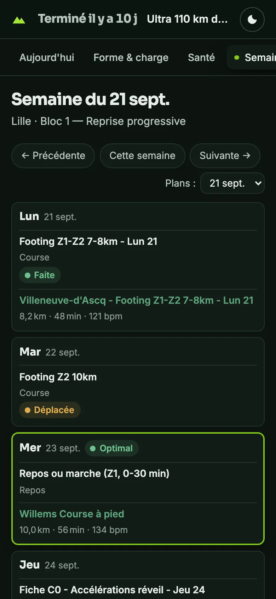{ width="260" }
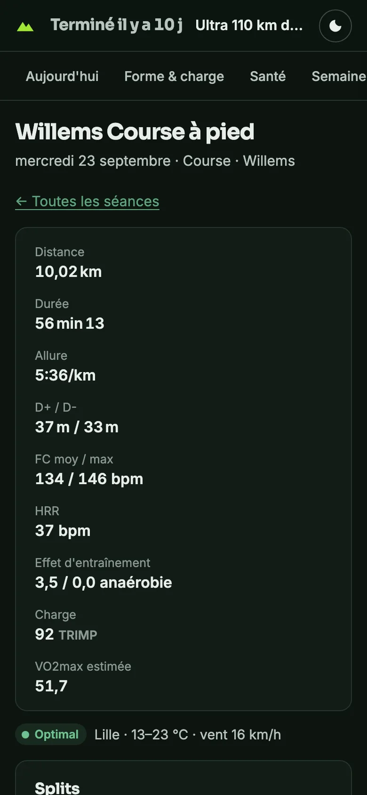{ width="260" }

## D'où vient chaque vue

Une vue vide ou incomplète se diagnostique presque toujours par le fichier qui la
nourrit :

| Vue | Fichiers lus | Écrits par |
|---|---|---|
| Aujourd'hui | `medical/<date>_health.md`, `medical/<date>_meteo.md`, `planning/Semaine_<lundi>.md` | synchronisation, coach |
| Forme & charge | `activities/*.md`, `planning/Runner_Profile.md` | synchronisation, vous |
| Santé | `medical/<date>_health.md` | synchronisation, coach |
| Semaine | `planning/Semaine_<lundi>.md`, `activities/*.md` | coach, synchronisation |
| Séances | `activities/<date>_<sport>.md` | synchronisation |
| Performance | `activities/*.md`, `planning/Runner_Profile.md`, `planning/active_objective.md` | synchronisation, vous |
| Calendrier | `activities/*.md` | synchronisation |
| Rapports | `rapports/*.md` | coach |
| Nutrition | `nutrition/<date>_nutrition.md` | nutritionniste |

Chacun de ces fichiers s'ouvre par un bloc de données décrit par le
[contrat de données](../skills/workspace-data-contract.md) : c'est ce bloc que le
tableau de bord lit, jamais la prose.
