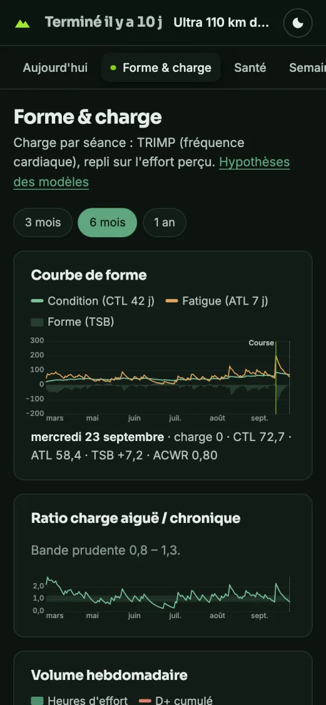
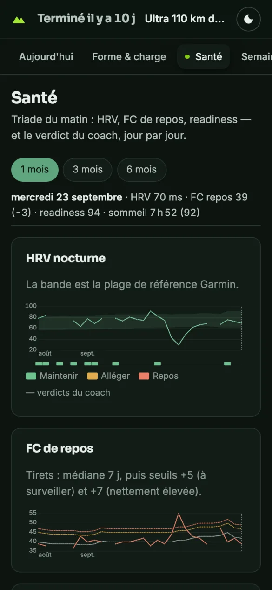

# Les vues

Toutes les captures viennent d'un vrai workspace : deux ans de fichiers
(août 2024 → septembre 2026), dont la préparation et le déroulé d'un ultra-trail de 110 km le 13
septembre 2026, puis la reprise. La date de référence est le 23 septembre, dix jours
après la course.

## Aujourd'hui

La vue du matin. Elle répond à une question : **je cours, j'allège ou je me repose ?**

- **Le verdict du coach**, tel qu'il l'a posé dans le fichier santé du jour :
  *Maintenir*, *Alléger* ou *Repos*, avec sa raison en une phrase. Sans verdict ce
  jour-là, la vue rappelle le dernier (ici celui du lundi) plutôt que d'en inventer un.
- **Le bilan du matin**, chaque mesure située par rapport à **votre** référence :
  la HRV dans sa bande Garmin, la FC de repos face à sa médiane des 7 derniers jours
  (seuils +5 « à surveiller » et +7 « nettement élevée » — les règles mêmes du coach),
  la readiness, le sommeil.
- **Au programme** : la séance planifiée du jour, la météo et le créneau conseillé.
- **Forme** : condition, fatigue, forme et ratio de charge, lus en une phrase.

## Forme & charge

La **courbe de forme** met côte à côte votre **condition** (CTL, moyenne de charge sur
42 jours), votre **fatigue** (ATL, 7 jours) et votre **forme** (TSB, leur écart) :
quand la fatigue passe sous la condition, vous êtes frais. Le jour de course est
marqué ; on y voit ici la fatigue bondir à plus de 200 le 13 septembre, puis la
forme redevenir positive pendant la reprise.

En dessous :

- le **ratio charge aiguë / chronique** (ACWR) et sa bande prudente 0,8 – 1,3 ;
- le **volume hebdomadaire** — heures d'effort et D+ cumulé en trail, kilomètres sur
  route —, la monotonie et le *strain* de la semaine.

Survolez un graphique (ou touchez-le, ou utilisez les flèches du clavier) : la ligne
sous le graphique donne les valeurs exactes du jour pointé.

## Santé

Les tendances du bilan matinal, sur 1, 3 ou 6 mois :

- **HRV nocturne** dans sa bande de référence ;
- **FC de repos** avec sa médiane 7 jours et les seuils +5 / +7 qui la suivent — le
  pic post-course à 55 bpm les franchit nettement, puis la FC redescend ;
- **readiness**, colorée par niveau, et **sommeil** face aux 7 h 30 visées.

Sous la HRV, **la frise des verdicts du coach**, jour par jour : c'est la décision
prise, lisible d'un coup d'œil sur des semaines.

Avec `[health].morning_check = "minimal"`, seule la readiness est tracée ; avec
`"off"`, la vue explique que le bilan est désactivé.

## Semaine

Le plan de la semaine face au réalisé. Pour chaque jour : les séances prévues et
leur statut (*Faite*, *Manquée*, *Déplacée*), la catégorie météo et le créneau, et
les séances réellement enregistrées — un clic ouvre leur détail. Ici, la semaine
d'affûtage : quatre sorties légères, puis les 109,7 km du dimanche.

En bas, le réalisé face à l'objectif de volume, et le texte du plan écrit par le coach.
La liste « Plans » saute aux semaines qui ont un plan.

## Séances

Tout l'historique : distance, durée, D+ (ou allure sur route), FC moyenne, HRR et
charge. Chaque colonne se trie, un filtre isole un sport. Une séance lue dans un
fichier antérieur au contrat porte la mention **approx.** ; une charge estimée
faute de fréquence cardiaque et d'effort perçu, un astérisque.

### Détail d'une séance

Les chiffres clés, la météo du jour, les **splits** (temps au kilomètre et FC) avec
la lecture du coach pour chaque kilomètre, puis **l'analyse complète du coach**,
rendue telle qu'il l'a écrite. Le chemin du fichier source est rappelé en bas : le
Markdown reste la référence.

## Performance

- **VO2max effective**, tendance 30 jours, estimée sur les séances de course
  qualifiantes (20 min à 3 h, au-dessus de 70 % de la FC max, pas de marche).
- **Prédictions** 5 km → marathon, et pour votre objectif : par le VDOT de Daniels
  et par la formule de Riegel. En trail, la distance « effort » ajoute le dénivelé.
- **Records** sur des fenêtres de splits consécutifs (précision au kilomètre).
- **Hypothèses** : toutes les formules et leurs limites, en clair.

## Calendrier

L'année en carte de chaleur (intensité = durée d'effort du jour) et la **distance
cumulée** comparée d'une année à l'autre.

## Rapports

Les rapports du coach — bilans hebdomadaires, comparaisons de parcours, analyses de
course — listés et rendus, tableaux compris. Ici, la comparaison entre la prévision
et le déroulé réel de l'ultra.

## Fichiers hors contrat

Les fichiers que le tableau de bord lit mal : sans bloc de données, bloc invalide,
ou illisible. Chacun dit ce qui lui manque. Le lien n'apparaît dans le menu que s'il
en reste ; pour les reprendre : [Migrer vos fichiers](migration.md).

## Sur le téléphone, en sombre

{ width="260" }
{ width="260" }
{ width="260" }

Le tableau s'adapte à un écran de téléphone, et suit le thème clair ou sombre du
système. Le bouton lune en haut à droite force l'un ou l'autre ; un lien avec
`?theme=dark` ou `?theme=light` aussi.
