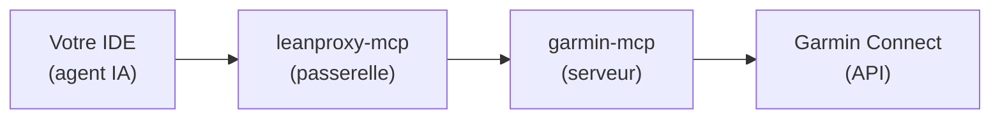

# 📡 Configuration Garmin

Cette page détaille l'accès à **Garmin Connect** utilisé par `ai-running-coach`.

## Architecture



- **`garmin-mcp`** — serveur MCP qui expose les données Garmin Connect (activités, santé, sommeil, calendrier, planification d'entraînements)
- **`leanproxy-mcp`** — passerelle MCP qui agrège les serveurs et les expose aux IDE
- **`garmin-mcp-auth`** — outil d'authentification OAuth (tokens stockés dans `~/.garminconnect/`)

## Composants installés

| Composant | Rôle | Installation |
|---|---|---|
| `uv` | Gestionnaire Python | `curl -LsSf https://astral.sh/uv/install.sh \| sh` |
| `garmin-mcp` | Serveur MCP Garmin | `uv tool install --python 3.12 git+https://github.com/Taxuspt/garmin_mcp` |
| `garmin-mcp-auth` | Authentification OAuth | via `uv run garmin-mcp-auth` |
| `leanproxy-mcp` | Passerelle MCP | `brew tap mmornati/leanproxy-mcp && brew install leanproxy-mcp` |

## Configuration leanproxy

Le script d'installation configure deux fichiers dans `~/.config/leanproxy/` :

### `config.yaml`

```yaml
server:
  host: "127.0.0.1"
  port: 8080
  timeout: 300s
  max_batch_size: 100
optimization:
  lazy_loading:
    enabled: true
    stub_tokens: 54
    cache_ttl: 24h
namespaces:
  sport:
    description: "Sport tools"
    servers:
      - garmin
    allowed_clients:
      - "*"
logging:
  level: "info"
  file: ""
```

### `leanproxy_servers.yaml`

```yaml
version: "1.0"
servers:
    - name: garmin
      enabled: true
      transport: stdio
      stdio:
        command: garmin-mcp
        args:
            - stdio
        env: []
        cwd: .
      timeout: 300s
      connect_timeout: 10s
      idle_timeout: ""
```

!!! note "Config existante"
    Le script **ne remplace pas** une configuration existante. Si `config.yaml` ou `leanproxy_servers.yaml` existent déjà, ils sont conservés.

## Authentification

Les tokens Garmin sont stockés dans `~/.garminconnect/` et sont valides environ **6 mois**.

### Vérifier les tokens

```bash
uv run garmin-mcp-auth --verify
```

### Renouveler l'authentification

```bash
uv run garmin-mcp-auth
```

## Données accessibles

Via `leanproxy_invoke_tool(server="garmin", tool="...")`, les agents peuvent accéder à :

- **Activités** : liste, détails, fichiers FIT
- **Santé** : HRV, sommeil, stress, fréquence cardiaque au repos
- **Calendrier** : séances planifiées, push d'entraînements
- **Planification** : création de séances (course, fractionné, renforcement)

## Dépannage

| Problème | Solution |
|---|---|
| `garmin-mcp` introuvable | `uv tool install --python 3.12 git+https://github.com/Taxuspt/garmin_mcp` |
| Tokens expirés | `uv run garmin-mcp-auth` |
| `leanproxy-mcp` introuvable | `brew tap mmornati/leanproxy-mcp && brew install leanproxy-mcp` |
| Erreur de connexion | Vérifiez que `garmin-mcp` fonctionne : `garmin-mcp stdio` |

Voir aussi la page [Dépannage](troubleshooting.md).
