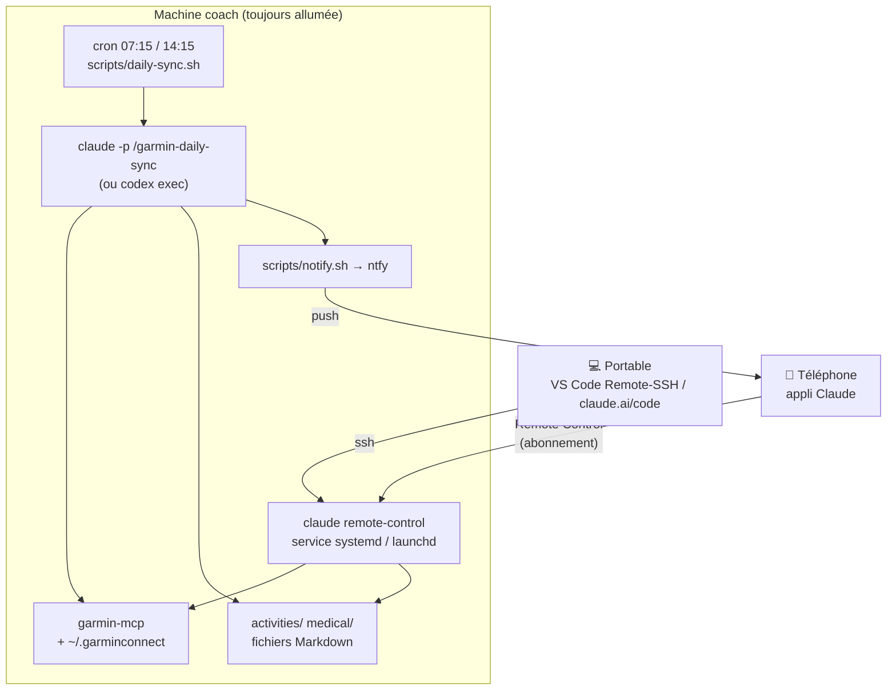

# 📱 Le coach dans la poche

Le projet fonctionne dans un IDE, sur un ordinateur. Cette page explique comment garder
le coach **toujours avec vous** — synchronisation Garmin automatique avec notification, et
dialogue avec le coach depuis le téléphone — **sans renoncer à votre abonnement**
Claude (Pro/Max) ou ChatGPT (Codex).

## Ce qui n'est pas possible (et pourquoi)

!!! warning "Pas de « front » mobile maison"
    Une appli ou un bot (Telegram, PWA, Agent SDK…) qui appellerait le modèle **ne peut
    pas** utiliser votre abonnement. Depuis avril 2026, Anthropic bloque l'authentification
    par abonnement pour tout outil tiers (OpenCode a dû retirer cette possibilité), et la
    connexion « Sign in with ChatGPT » d'OpenAI est réservée à Codex CLI/App. Un front
    maison implique donc une clé API facturée au token.

La seule voie qui préserve l'abonnement : utiliser les **surfaces distantes officielles**
des éditeurs, en gardant une **machine « coach »** où vivent le workspace (`activities/`,
`medical/`, `planning/`…), les tokens Garmin et le serveur MCP.

| Besoin | Solution officielle | Abonnement | Limites |
|---|---|---|---|
| Parler au coach depuis le téléphone | **Claude Code Remote Control** — `claude remote-control` tourne sur la machine coach, l'appli Claude (iOS/Android) ou claude.ai/code s'y connecte | ✅ Pro/Max/Team/Enterprise (clé API refusée) | Le processus doit rester lancé (service systemd/launchd fourni) |
| Idem avec Codex | **Codex Remote** — appli Codex sur macOS + appli ChatGPT | ✅ ChatGPT Plus/Pro | macOS uniquement (le mode CLI est expérimental) |
| Synchronisation automatique | **cron/launchd → `claude -p` ou `codex exec`** (CLI officiels, headless) | ✅ | — |
| Machine éteinte | *Routines cloud* Claude (voir [plan B](#plan-b-cloud-anthropic-sans-machine-a-la-maison)) | ✅ Pro (5 exécutions/jour) / Max (15) | Workspace dans un dépôt GitHub, tokens Garmin en secrets |

!!! note "Pourquoi pas les « routines » ou les tâches planifiées de l'appli Claude ?"
    Les routines cloud s'exécutent dans une VM Anthropic (sans votre `garmin-mcp` ni vos
    fichiers), les tâches planifiées de l'appli de bureau ne tournent que si l'appli est
    ouverte, et les environnements auto-hébergés sont réservés aux plans Team/Enterprise.
    Sur une machine sans écran, le déclencheur fiable reste le **cron du système**.

## Architecture recommandée : la machine « coach »

Un ordinateur toujours allumé à la maison (Mac mini, mini-PC Linux, NAS, Raspberry Pi,
vieux portable) — 1 Go de RAM libre suffit.



- **Le workspace vit sur la machine coach** (source de vérité unique). Depuis le portable,
  vous continuez à travailler dans l'IDE via *VS Code Remote-SSH* ou claude.ai/code.
- **Interactif** : `claude remote-control` (mode serveur) tourne en service. Depuis
  l'appli Claude, vous ouvrez une session qui s'exécute *sur la machine coach* : agent
  `coach`, skills, serveur MCP `garmin`, fichiers du workspace. Les confirmations d'outils
  (push d'une séance dans le calendrier Garmin…) s'affichent sur le téléphone.
- **Automatique** : deux fois par jour (après la nuit, après la sortie du midi), le cron
  lance `claude -p "/garmin-daily-sync"` : le skill délègue à l'agent `coach` +
  `garmin-sync-efficiency`, ne récupère que les dates manquantes, persiste les fichiers MD
  et termine par un résumé de 5 lignes envoyé en notification push.

## Installation pas à pas

### 1. Préparer la machine coach

```bash
# Claude Code (obligatoire pour Remote Control et le runner "claude")
curl -fsSL https://claude.ai/install.sh | bash
claude          # puis /login → connexion avec votre compte claude.ai (PAS de clé API)
```

Sur une machine sans navigateur, `/login` affiche une URL à ouvrir depuis un autre appareil
et un code à coller. Vérifiez avec `claude auth status` (`"loggedIn": true`).

```bash
# Optionnel : Codex CLI comme exécuteur de la synchronisation
npm i -g @openai/codex
codex login --device-auth
```

### 2. Installer le projet et l'accès Garmin

```bash
git clone https://github.com/mmornati/ai-running-coach.git
cd ai-running-coach
./install.sh --ide claude
```

L'authentification Garmin (`garmin-mcp-auth`, MFA compris) fonctionne en SSH. Si vos tokens
existent déjà sur le portable, copiez simplement le dossier (permissions 600) :

```bash
rsync -az ~/.garminconnect/ machine-coach:~/.garminconnect/
```

Si vous migrez un workspace existant, copiez aussi les dossiers personnels — ils restent
exclus du dépôt (`.gitignore`) :

```bash
rsync -az --exclude .DS_Store activities medical nutrition planning rapports resources machine-coach:~/ai-running-coach/
```

`install.sh` **pré-approuve** le serveur MCP `garmin` du projet dans `~/.claude.json` :
sans cela, Claude Code le laisse « Pending approval » jusqu'à une session interactive, ce qui
bloque une machine sans écran. Vérifiez avec `claude mcp list` (→ `garmin … ✔ Connected`).

### 3. Notifications push (ntfy)

[ntfy](https://ntfy.sh) est gratuit, sans compte, avec une appli iOS/Android. Le script
choisit le serveur (public `ntfy.sh` ou le vôtre), le sujet, enregistre un éventuel token
**hors du dépôt** et envoie une notification de test :

```bash
scripts/setup-ntfy.sh
```

=== "ntfy.sh (public)"

    Le sujet fait office de secret : gardez celui proposé (`running-coach-xxxxxxxx`) ou
    choisissez-en un difficile à deviner. Dans l'appli ntfy : « + » → abonnez-vous au sujet.

=== "Serveur auto-hébergé"

    Avec `auth-default-access: deny-all`, créez un utilisateur et un token en écriture :

    ```bash
    docker exec -it ntfy ntfy user add --role=user coach
    docker exec -it ntfy ntfy access coach running-coach-xxxxxxxx write-only
    docker exec -it ntfy ntfy token add coach     # → tk_…
    ```

    Donnez ce token à `scripts/setup-ntfy.sh` : il est stocké dans
    `~/.config/ai-running-coach/ntfy.token` (chmod 600) et référencé par
    `ntfy_token_file` dans `config/workspace.user.toml`.

### 4. Synchronisation automatique

```bash
./install.sh --daily-sync
```

Installe deux entrées cron (Linux) ou un LaunchAgent (macOS) aux heures de
`[sync].times` dans `config/workspace.toml` (défaut `07:15` et `14:15`, à surcharger dans
`workspace.user.toml`). Testez sans attendre :

```bash
scripts/daily-sync.sh --dry-run   # affiche la commande
scripts/daily-sync.sh             # exécution réelle, journal dans logs/sync-YYYY-MM-DD.log
```

Exemple de notification reçue :

```
🏃 Sync Garmin
Séances : 1 nouvelle — trail 12,3 km / 480 m D+ / FC moy 148 / HRR 28 bpm (2026-09-20)
Sommeil : 7 h 42, score 81
HRV : 62 ms — équilibré (baseline 58-66)
Readiness : 74
Alerte : aucune
```

Pour utiliser Codex à la place de Claude Code : `runner = "codex"` dans
`config/workspace.user.toml` (section `[sync]`).

### 5. Le coach sur le téléphone (Remote Control)

```bash
./install.sh --remote-control     # ou : scripts/coach-remote.sh install
```

1. **Première fois** : Remote Control demande une confirmation unique (`Enable Remote
   Control? (y/n)`) qu'un service en arrière-plan ne peut pas accepter. Le script vous
   propose de lancer `claude remote-control` une fois au premier plan : répondez `y`,
   attendez l'URL/QR code, puis `Ctrl+C`. En SSH, utilisez `ssh -t` pour avoir un terminal.
2. Le service (`systemd --user` + `loginctl enable-linger` sur Linux, LaunchAgent sur macOS)
   démarre au boot et relance le serveur s'il s'arrête (il reprend ses sessions pendant
   ~4 h).
3. Sur le téléphone : **appli Claude → onglet Code** → la session « AI Running Coach »
   apparaît. Vous pouvez aussi scanner le QR code affiché au démarrage
   (`scripts/coach-remote.sh logs`).

```bash
scripts/coach-remote.sh status    # état + dernière URL de session
scripts/coach-remote.sh restart
scripts/coach-remote.sh uninstall
```

Exemples depuis le téléphone : *« Résume ma semaine »*, *« Analyse ma sortie de ce midi »*,
*« Décale la séance de jeudi à vendredi et mets-la dans Garmin »*, ou `/garmin-daily-sync`
pour forcer une synchronisation.

!!! tip "Mode de permission"
    Le service démarre en `acceptEdits` : l'écriture des fichiers MD est automatique, mais
    les outils Garmin d'écriture (`schedule_workouts`, `upload_course`…) restent confirmés
    depuis le téléphone. Modifiez avec `--permission-mode` si besoin.

## Et Codex ?

- **Synchronisation** : `runner = "codex"` — `scripts/daily-sync.sh` lance
  `codex exec --full-auto` avec le corps du skill `garmin-daily-sync` comme prompt.
- **Mobile** : *Codex Remote* (GA juin 2026) pilote depuis l'appli ChatGPT une session de
  l'**appli Codex sur macOS**. Sur une machine coach Linux, ce n'est pas disponible (le
  `codex remote-control` en CLI est expérimental) : utilisez Remote Control de Claude
  Code pour l'interactif et, si vous le souhaitez, Codex pour la synchronisation.

## Plan B : cloud Anthropic, sans machine à la maison

Si aucune machine ne peut rester allumée, les **routines** et **sessions cloud** de Claude
Code (Pro/Max) tournent dans une VM Anthropic — avec des contraintes :

1. Le workspace doit vivre dans un **dépôt GitHub privé** (dossiers personnels + ce projet).
2. Un **script d'environnement** installe `uv` + `garmin-mcp` et restaure
   `~/.garminconnect/` depuis un secret d'environnement (ex. `GARMIN_TOKENS_B64`) ;
   `garmin-mcp` accepte `GARMIN_EMAIL`/`GARMIN_PASSWORD` mais ne peut pas répondre au MFA,
   donc les tokens restent le bon véhicule. Ajoutez `*.garmin.com` et `wttr.in` à la liste
   réseau autorisée.
3. Une **routine** (`/schedule`) exécute `/garmin-daily-sync` chaque matin et **commite**
   les fichiers MD ; le dialogue interactif passe par une session cloud depuis l'onglet Code
   de l'appli Claude, sur le même dépôt/environnement.

Risques à connaître : quotas de routines (5/jour Pro, 15/jour Max), tokens Garmin à
renouveler tous les ~6 mois depuis un ordinateur, et Garmin peut limiter les IP de
datacenter (à valider une fois). C'est pourquoi la machine coach reste le choix recommandé.

## Limites et dépannage

| Symptôme | Cause / solution |
|---|---|
| La session est « hors ligne » sur le téléphone | Le processus `claude remote-control` est arrêté : `scripts/coach-remote.sh status` puis `restart`. Les sessions restent reprenables ~4 h. |
| `claude mcp list` → `garmin … Pending approval` | Relancez `./install.sh --ide claude` (pré-approbation dans `~/.claude.json`) ou lancez `claude` une fois dans le projet et approuvez. |
| `Remote Control requires claude.ai subscription auth` | `ANTHROPIC_API_KEY` est défini ou vous êtes connecté par clé API : retirez la variable, `claude` → `/login`. |
| Le service démarre puis s'arrête en boucle | Confirmation unique jamais acceptée : lancez `claude remote-control` une fois au premier plan. |
| `❌ Sync Garmin échouée` | Voir `logs/sync-YYYY-MM-DD.log`. Cause fréquente : tokens Garmin expirés → `uv run garmin-mcp-auth`. |
| Pas de notification | `scripts/notify.sh "test"` ; vérifiez `provider`, `ntfy_topic`, le token (serveur `deny-all`) et l'abonnement au sujet dans l'appli. |
| Sur Linux, le service meurt à la déconnexion SSH | `loginctl enable-linger $USER` (fait par `install`). |
| Le portable et la machine coach ont chacun un workspace | Gardez une seule source de vérité (la machine coach) et travaillez dessus en Remote-SSH ; sinon synchronisez les dossiers avec `rsync`. |
